# Agents.md

## Build & Run
- **Build:** `$env:JAVA_HOME = "C:\Program Files\Android\Android Studio1\jbr"; .\gradlew.bat installDebug`
- **Release Build:** `$env:JAVA_HOME = "C:\Program Files\Android\Android Studio1\jbr"; .\gradlew.bat assembleRelease`
- **Gradle:** 9.5.0, AGP 9.3.0, KSP 2.2.10-2.0.2 (for Glide)
- **Compile SDK:** 35 (Android 15) — required by media3 1.5.1
- **Min SDK:** 24 (Android 7.0)
- **Target SDK:** 34 (Android 14)
- **Version:** `versionCode=112`, `versionName=2.0.12-beta` (in `app/build.gradle.kts`)
- **BuildConfig fields:** `GIT_COMMIT` (short hash from `git rev-parse --short HEAD`, fallback `"dev"`) + `BUILD_DATE` (`yyyy.MM.dd-HHmm`) — requires `buildFeatures { buildConfig = true }`; shown in Settings About section
- **Language:** Kotlin
- **Package:** `com.weebflix.app`
- **Device:** `adb` at `C:\Users\pro021\AppData\Local\Android\Sdk\platform-tools\adb.exe`

## Project Structure
```
WeebFlix/app/src/main/
├── java/com/weebflix/app/
│   ├── WeebFlixApp.kt                  # Application class, provider registry init
│   ├── data/
│   │   ├── config/ProviderConfig.kt    # Per-provider base URL + active provider via SharedPreferences
│   │   ├── model/
│   │   │   ├── Models.kt              # Anime, Episode, VideoServer, AnimeDetail, EpisodeNavigation
│   │   │   └── WatchHistoryManager.kt # Watch progress storage (per provider, SharedPreferences)
│   │   ├── provider/
│   │   │   ├── AnimeProvider.kt       # Provider interface (all scraper methods)
│   │   │   └── ProviderFactory.kt     # Singleton registry, getActiveProvider(), refreshBaseUrls()
│   │   └── scraper/
│   │       ├── SamehadakuScraper.kt   # Anime scraper (Jsoup) — implements AnimeProvider
│   │       ├── OppaDramaScraper.kt    # Drakor scraper (Jsoup) — implements AnimeProvider
│   │       ├── AnichinScraper.kt     # Donghua/Anime scraper (Jsoup) — implements AnimeProvider
│   │       └── OtakudesuScraper.kt   # Anime scraper (Jsoup, Blogspot streaming) — implements AnimeProvider
│   │       └── MissavScraper.kt      # JAV scraper (Jsoup + m3u8 regex) — implements AnimeProvider
│   └── ui/
│       ├── splash/SplashActivity.kt      # Splash with animated N logo
│       ├── main/MainActivity.kt          # Bottom nav host (Home/Search/Ongoing/Settings)
│       ├── home/
│       │   ├── HomeFragment.kt           # Provider chip switcher + fragment container
│       │   ├── SamehadakuHomeFragment.kt # Samehadaku home (static hero + 3 rows)
│       │   ├── DrakorKitaHomeFragment.kt # DrakorKita home (auto-scroll hero + 3 rows)
│   │       ├── OppaDramaHomeFragment.kt # DrakorKita home (5 clickable sections + h-scroll)
│   │       ├── AnichinHomeFragment.kt  # Anichin home (Continue Watching + latest + ongoing + completed + all anime)
│   │       └── MissavHomeFragment.kt   # MissAV home (static hero + Continue Watching + latest + ongoing + popular + uncensored)
│       ├── search/SearchFragment.kt      # Real-time search with history
│       ├── ongoing/OngoingFragment.kt    # Grid with vertical infinite scroll
│       ├── settings/SettingsFragment.kt  # Per-provider domain config (Fragment, not Activity)
│       ├── detail/
│       │   ├── AnimeDetailActivity.kt    # Parallax detail + episode list
│   │   └── CategoryGridActivity.kt   # Full-screen 3-col grid (all providers) + auto-fill
│       ├── player/PlayerActivity.kt      # ExoPlayer + WebView + multi-provider server resolution
│       └── adapter/
│           ├── LatestEpisodeAdapter.kt   # Samehadaku episode cards
│           ├── AnimeAdapter.kt           # Samehadaku anime cards
│           ├── NetflixCardAdapter.kt     # Netflix-style compact card (DrakorKita)
│           ├── DramaCardAdapter.kt       # Drama card with rating badge
│           ├── HeroPagerAdapter.kt       # ViewPager2 hero banner carousel
│           ├── EpisodeListAdapter.kt     # Episode list with spinner
│           ├── SearchGridAdapter.kt      # Search results grid
│           ├── SearchHistoryAdapter.kt   # Search history chips
│           └── ContinueWatchingAdapter.kt # Continue watching with progress bar
└── res/
    ├── layout/        # XML layouts (Netflix dark theme) — + dialog_yt_account.xml (account bottom sheet)
    ├── layout-land/   # Layout landscape khusus TV (two-pane detail + card besar)
    ├── layout-sw600dp/ # Card variants TV/tablet class (≥600dp: item_anime_card, item_youtube_feed, dll.)
    ├── drawable/      # Vector icons, backgrounds, gradients
    ├── values/        # colors.xml, strings.xml, themes.xml
    ├── anim/          # Splash animations
    └── menu/          # Bottom navigation menu
```

## Dependency Graph
Graf ketergantungan antar-kelas (di-generate dari import aktual, 2026-08). Layer bawah = lebih "dasar"/independen; anak panah `A → B` artinya `A` import/memakai `B`. Ikuti arah ini saat mengubah sesuatu: ubah layer bawah dulu (biasanya aman), lalu turunkan/dari atas baru periksa callers.

### Layering (bottom → top)
```
┌─────────────────────────────────────────────────────────────────────┐
│ UI LAYER (adapter / home / search / ongoing / detail / settings     │
│            / player / youtube / splash / main)                      │
│   └─ satu-satunya yang "tahu" tentang Android views + Activity nav  │
├─────────────────────────────────────────────────────────────────────┤
│ DATA LAYER (scraper / provider / auth / model / config)             │
│   ├─ scrapers: Samehadaku, DrakorKita, Anichin, OppaDrama, Otakudesu,  │
│   │             MissAV, YouTube                                        │
│   ├─ provider: AnimeProvider (interface) + ProviderFactory (registry)│
│   ├─ auth:    YouTubeAuthManager + LoopbackOAuthServer              │
│   ├─ model:   Models, WatchHistoryManager, ProviderDataCache,       │
│   │           GitHubDataFetcher                                     │
│   └─ config:  ProviderConfig (SharedPreferences)                    │
├─────────────────────────────────────────────────────────────────────┤
│ PLATFORM (Android SDK / media3-ExoPlayer / OkHttp / Jsoup / Glide)  │
└─────────────────────────────────────────────────────────────────────┘
```

### Mermaid (renders di GitHub)

```mermaid
flowchart TB
    %% Entry & lifecycle
    WeebFlixApp --> ProviderConfig
    WeebFlixApp --> ProviderFactory
    WeebFlixApp --> SamehadakuScraper
    WeebFlixApp --> YouTubeAuthManager

    %% config
    ProviderConfig

    %% model
    Models
    WatchHistoryManager
    ProviderDataCache
    GitHubDataFetcher --> ProviderDataCache

    %% provider
    AnimeProvider --> Models
    ProviderFactory --> ProviderConfig
    ProviderFactory --> AnichinScraper
    ProviderFactory --> DrakorKitaScraper
    ProviderFactory --> OppaDramaScraper
    ProviderFactory --> OtakudesuScraper
    ProviderFactory --> MissavScraper
    ProviderFactory --> SamehadakuScraper
    ProviderFactory --> YouTubeScraper

    %% scraper
    AnichinScraper --> ProviderConfig
    AnichinScraper --> Models
    AnichinScraper --> AnimeProvider
    DrakorKitaScraper --> ProviderConfig
    DrakorKitaScraper --> Models
    DrakorKitaScraper --> AnimeProvider
    OppaDramaScraper --> ProviderConfig
    OppaDramaScraper --> Models
    OppaDramaScraper --> AnimeProvider
    OtakudesuScraper --> ProviderConfig
    OtakudesuScraper --> Models
    OtakudesuScraper --> AnimeProvider
    MissavScraper --> ProviderConfig
    MissavScraper --> Models
    MissavScraper --> AnimeProvider
    SamehadakuScraper --> ProviderConfig
    SamehadakuScraper --> Models
    SamehadakuScraper --> AnimeProvider
    YouTubeScraper --> ProviderConfig
    YouTubeScraper --> Models
    YouTubeScraper --> AnimeProvider
    YouTubeScraper --> YouTubeResolver
    YouTubeResolver --> YouTubeAuthManager
    YouTubeResolver --> YouTubeCipher
    YouTubeResolver --> PoTokenManager
    YouTubeDataApi --> YouTubeAuthManager
    YouTubeDataApi --> YouTubeSubscriptionStore
    YouTubeDataApi --> Models
    YouTubeSubscriptionStore --> YouTubeAuthManager
    YouTubeSubscriptionStore --> Models

    %% auth
    YouTubeAuthManager --> ProviderConfig
    YouTubeAuthManager --> YouTubeResolver
    LoopbackOAuthServer

    %% UI: main / splash / home
    SplashActivity --> MainActivity
    MainActivity --> ProviderConfig
    MainActivity --> ProviderFactory
    MainActivity --> HomeFragment
    MainActivity --> OngoingFragment
    MainActivity --> SearchFragment
    MainActivity --> SettingsFragment
    MainActivity --> YouTubeHomeFragment
    MainActivity --> YouTubeHistoryFragment
    HomeFragment --> ProviderConfig
    HomeFragment --> ProviderFactory
    HomeFragment --> MainActivity
    HomeFragment --> YouTubeHomeFragment

    %% UI: home fragments -> data + detail/player/category
    SamehadakuHomeFragment --> ProviderFactory
    SamehadakuHomeFragment --> WatchHistoryManager
    SamehadakuHomeFragment --> AnimeDetailActivity
    SamehadakuHomeFragment --> CategoryGridActivity
    SamehadakuHomeFragment --> PlayerActivity
    DrakorKitaHomeFragment --> ProviderFactory
    DrakorKitaHomeFragment --> DrakorKitaScraper
    DrakorKitaHomeFragment --> WatchHistoryManager
    DrakorKitaHomeFragment --> AnimeDetailActivity
    DrakorKitaHomeFragment --> PlayerActivity
    OppaDramaHomeFragment --> ProviderFactory
    OppaDramaHomeFragment --> OppaDramaScraper
    OppaDramaHomeFragment --> WatchHistoryManager
    OppaDramaHomeFragment --> AnimeDetailActivity
    OppaDramaHomeFragment --> CategoryGridActivity
    OppaDramaHomeFragment --> PlayerActivity
    AnichinHomeFragment --> ProviderFactory
    AnichinHomeFragment --> WatchHistoryManager
    AnichinHomeFragment --> ProviderDataCache
    AnichinHomeFragment --> AnimeDetailActivity
    AnichinHomeFragment --> CategoryGridActivity
    OtakudesuHomeFragment --> ProviderFactory
    OtakudesuHomeFragment --> WatchHistoryManager
    OtakudesuHomeFragment --> ProviderDataCache
    OtakudesuHomeFragment --> AnimeDetailActivity
    OtakudesuHomeFragment --> CategoryGridActivity
    OtakudesuHomeFragment --> PlayerActivity
    MissavHomeFragment --> ProviderFactory
    MissavHomeFragment --> WatchHistoryManager
    MissavHomeFragment --> AnimeDetailActivity
    MissavHomeFragment --> CategoryGridActivity
    MissavHomeFragment --> PlayerActivity

    %% UI: search / ongoing / detail / settings
    SearchFragment --> AnimeDetailActivity
    OngoingFragment --> ProviderFactory
    OngoingFragment --> ProviderConfig
    OngoingFragment --> AnimeDetailActivity
    AnimeDetailActivity --> ProviderFactory
    AnimeDetailActivity --> PlayerActivity
    CategoryGridActivity --> ProviderFactory
    CategoryGridActivity --> AnichinScraper
    CategoryGridActivity --> DrakorKitaScraper
    CategoryGridActivity --> OppaDramaScraper
    SettingsFragment --> ProviderConfig
    SettingsFragment --> ProviderFactory
    SettingsFragment --> YouTubeAuthManager

    %% UI: player + Hydrax data source
    PlayerActivity --> WatchHistoryManager
    PlayerActivity --> YouTubeScraper
    PlayerActivity --> YouTubeFeedAdapter
    PlayerActivity --> HydraxDataSource

    %% UI: youtube
    YouTubeHomeFragment --> YouTubeAuthManager
    YouTubeHomeFragment --> ProviderFactory
    YouTubeHomeFragment --> YouTubeScraper
    YouTubeHomeFragment --> PlayerActivity
    YouTubeHistoryFragment --> WatchHistoryManager
    YouTubeHistoryFragment --> ProviderFactory
    YouTubeHistoryFragment --> PlayerActivity
    YouTubeSearchActivity --> ProviderFactory
    YouTubeSearchActivity --> YouTubeScraper
    YouTubeSearchActivity --> PlayerActivity
    YouTubeLoginActivity --> LoopbackOAuthServer
    YouTubeLoginActivity --> YouTubeAuthManager
    YouTubeLoginActivity --> YouTubeResolver

    %% UI: adapters -> model/scraper types
    AnimeAdapter --> Models
    LatestEpisodeAdapter --> Models
    NetflixCardAdapter --> Models
    DramaCardAdapter --> Models
    HeroPagerAdapter --> Models
    EpisodeListAdapter --> Models
    SearchGridAdapter --> Models
    ContinueWatchingAdapter --> WatchHistoryManager
    YouTubeFeedAdapter --> YouTubeScraper
    YouTubeSearchAdapter --> YouTubeScraper
    YouTubeHistoryAdapter --> WatchHistoryManager
```


### Dependency table (per file → yang di-import)
| File | Bergantung pada |
|------|-----------------|
| `WeebFlixApp` | ProviderConfig, ProviderFactory, SamehadakuScraper, YouTubeAuthManager, YouTubeResolver (initPoToken) |
| `data/config/ProviderConfig` | (mandiri — SharedPreferences, titik konfigurasi global) |
| `data/model/Models` | (mandiri — data class Anime/Episode/VideoServer/AnimeDetail) |
| `data/model/WatchHistoryManager` | (mandiri — SharedPreferences progress) |
| `data/model/ProviderDataCache` | (mandiri — cache memory/disk home data) |
| `data/model/GitHubDataFetcher` | ProviderDataCache |
| `data/provider/AnimeProvider` | Models (interface kontrak scraper) |
| `data/provider/ProviderFactory` | ProviderConfig, 7 scraper (Samehadaku/DrakorKita/Anichin/OppaDrama/YouTube/Otakudesu/MissAV) |
| `data/scraper/*` (5 scraper lama) | ProviderConfig, Models, AnimeProvider |
| `data/scraper/YouTubeScraper` | ProviderConfig, Models, AnimeProvider, YouTubeResolver |
| `data/scraper/YouTubeResolver` | YouTubeAuthManager, YouTubeCipher |
| `data/scraper/YouTubeCipher` | (mandiri — decipher logic) |
| `data/scraper/PoTokenManager` | (mandiri — WebView BotGuard PO token generator, po_token.html asset) |
| `data/scraper/YouTubeDashManifest` | (mandiri — DASH manifest builder) |
| `data/scraper/YouTubeModels` | (mandiri — YouTubeVideo/YouTubeVideoDetail/YouTubeStream, YouTubeChannel, YouTubeHistoryItem) |
| `data/scraper/YouTubeDataApi` | YouTubeAuthManager, YouTubeSubscriptionStore, YouTubeModels — klien Data API v3 (subscriptions/activities/videos/rate/playlistItems HL) |
| `data/scraper/YouTubeSubscriptionStore` | YouTubeAuthManager (email), YouTubeModels — cache langganan per-akun (SharedPreferences, init di WeebFlixApp) |
| `data/auth/YouTubeAuthManager` | ProviderConfig, YouTubeResolver (⚠ circular: resolver memakai auth token/cookies, auth memakai resolver.clearMemo) |
| `data/auth/LoopbackOAuthServer` | (mandiri — ServerSocket localhost callback) |
| `ui/splash/SplashActivity` | MainActivity |
| `ui/main/MainActivity` | ProviderConfig, ProviderFactory, HomeFragment, OngoingFragment, SearchFragment, SettingsFragment, YouTubeHomeFragment, YouTubeHistoryFragment |
| `ui/home/HomeFragment` | ProviderConfig, ProviderFactory, MainActivity, YouTubeHomeFragment |
| `ui/home/SamehadakuHomeFragment` | WeebFlixApp, Models, WatchHistoryManager, ProviderFactory, ProviderDataCache, AnimeAdapter, ContinueWatchingAdapter, LatestEpisodeAdapter, AnimeDetailActivity, CategoryGridActivity, PlayerActivity |
| `ui/home/DrakorKitaHomeFragment` | Models, WatchHistoryManager, ProviderFactory, DrakorKitaScraper, ContinueWatchingAdapter, HeroPagerAdapter, NetflixCardAdapter, AnimeDetailActivity, PlayerActivity |
| `ui/home/OppaDramaHomeFragment` | Models, WatchHistoryManager, ProviderFactory, OppaDramaScraper, ContinueWatchingAdapter, HeroPagerAdapter, NetflixCardAdapter, AnimeDetailActivity, CategoryGridActivity, PlayerActivity |
| `ui/home/AnichinHomeFragment` | Models, WatchHistoryManager, ProviderFactory, ProviderDataCache, AnimeAdapter, ContinueWatchingAdapter, LatestEpisodeAdapter, AnimeDetailActivity, CategoryGridActivity |
| `ui/home/OtakudesuHomeFragment` | Models, WatchHistoryManager, ProviderFactory, ProviderDataCache, AnimeAdapter, ContinueWatchingAdapter, LatestEpisodeAdapter, AnimeDetailActivity, CategoryGridActivity, PlayerActivity |
| `ui/home/MissavHomeFragment` | Models, WatchHistoryManager, ProviderFactory, AnimeAdapter, ContinueWatchingAdapter, LatestEpisodeAdapter, AnimeDetailActivity, CategoryGridActivity, PlayerActivity |
| `ui/search/SearchFragment` | WeebFlixApp, SearchGridAdapter, SearchHistoryAdapter, AnimeDetailActivity |
| `ui/ongoing/OngoingFragment` | ProviderConfig, Models, ProviderFactory, SearchGridAdapter, AnimeDetailActivity |
| `ui/detail/AnimeDetailActivity` | WeebFlixApp, Models, ProviderFactory, EpisodeListAdapter, PlayerActivity |
| `ui/detail/CategoryGridActivity` | Models, ProviderFactory, AnichinScraper, DrakorKitaScraper, OppaDramaScraper |
| `ui/settings/SettingsFragment` | BuildConfig, ProviderConfig, ProviderFactory, YouTubeAuthManager |
| `ui/player/PlayerActivity` | WeebFlixApp, VideoServer, WatchHistoryManager, YouTubeScraper, YouTubeVideo, YouTubeFeedAdapter, HydraxDataSource |
| `ui/player/HydraxDataSource` | (mandiri — ExoPlayer DataSource untuk `hydrax://`) |
| `ui/youtube/YouTubeHomeFragment` | YouTubeAuthManager, ProviderFactory, YouTubeScraper, YouTubeVideo, PlayerActivity, YouTubeFeedAdapter |
| `ui/youtube/YouTubeHistoryFragment` | WatchHistoryEntry, WatchHistoryManager, ProviderFactory, PlayerActivity, YouTubeHistoryAdapter |
| `ui/youtube/YouTubeSearchActivity` | ProviderFactory, YouTubeScraper, YouTubeVideo, PlayerActivity, YouTubeSearchAdapter |
| `ui/youtube/YouTubeLoginActivity` | LoopbackOAuthServer, YouTubeAuthManager, YouTubeResolver |
| `ui/youtube/YouTubeChannelActivity` | YouTubeScraper, YouTubeDataApi, YouTubeAuthManager, YouTubeVideo, YouTubeChannelDetail, PlayerActivity, YouTubeSearchAdapter |
| `ui/adapter/*` | Models (Anime/Episode/WatchHistoryEntry) + `R` |
| `ui/youtube/adapter/YouTubeFeedAdapter` / `YouTubeSearchAdapter` | YouTubeVideo |
| `ui/youtube/adapter/YouTubeHistoryAdapter` | WatchHistoryEntry |

### Poin penting
- **Semua scraper** hanya import `data/` — tidak pernah import `ui/`. Kalau UI butuh data, lewat `ProviderFactory.getActiveProvider()`.
- **`ProviderConfig` = hub global** — hampir semua layer baca base URL / provider aktif dari sini. Ubah dengan hati-hati (banyak caller).
- **⚠ Satu-satunya circular dependency:** `YouTubeAuthManager ↔ YouTubeResolver` (token untuk request player ↔ `clearMemo()` saat login/logout). Dibiarkan karena sama-package-free (lint OK), jangan menambah siklus baru.
- **`PlayerActivity` adalah pusat routing video** — menyentuh scraper (YouTubeScraper), model (WatchHistoryManager/VideoServer), dan UI (YouTubeFeedAdapter + HydraxDataSource).
- **UI detail/home jarang dipanggil balik oleh data layer** — arah dependency selalu UI → Data → Platform, kecuali `WeebFlixApp` (entry) yang boleh menunjuk ke mana saja.

## Folder Responsibility & Clean Architecture

### Penilaian arsitektur (audit 2026-08)
**Status: "clean-ish / pragmatic layered architecture"** — 3 layer logis (Presentation / Data / Platform) dengan **dependency rule dipatuhi**, tapi **BUKAN strict Clean Architecture** (Robert C. Martin). Tidak ada layer `domain` terpisah — ini pilihan pragmatis untuk app scraper sebesar ini.

| Prinsip Clean Architecture | Status | Catatan |
|---------------------------|--------|---------|
| Dependency rule (UI → Data → Platform) | ✅ Dipatuhi | `data/` tidak pernah import `ui/`; `WeebFlixApp` (entry) adalah satu-satunya pengecualian yang bebas menunjuk ke mana saja |
| Abstraction via interface (Repository pattern) | ✅ Dipatuhi | UI hanya pegang `AnimeProvider` (interface) lewat `ProviderFactory` — tidak pernah menyentuh class scraper konkret |
| Registry / injection point | ✅ Ada | `ProviderFactory` = manual DI (tanpa framework); provider di-lazy-init sekali |
| Platform code tersembunyi | ✅ Ada | OkHttp/Jsoup/SharedPreferences/ExoPlayer hanya dipakai di layer `data/` |
| Layer `domain` terpisah (entities, use-cases, repository interface) | ❌ Tidak ada | `AnimeProvider` (kontrak) + `Models` (entity/DTO) + scraper (repository+data-source) semua tinggal di `data/` — digabung |
| Presentation menahan logic | ⚠️ Berat | `PlayerActivity` ~4300 baris (routing, WebView injection, ExoPlayer config, progress) = god object; `HomeFragment.selectProvider()` masih pakai `when` untuk map provider→fragment |
| Model murni / DTO terpisah | ⚠️ Digabung | `Anime`/`Episode` dipakai langsung sebagai entity + DTO — OK untuk skala ini |
| Global state | ⚠️ Singleton object | `ProviderFactory`/`ProviderConfig`/`WatchHistoryManager`/`ProviderDataCache`/`GitHubDataFetcher` semuanya `object` — sulit di-test, tapi konsisten |

**Kesimpulan:** jangan refactor ke domain layer penuh kecuali benar-benar dibutuhkan. Yang penting dipertahankan: (1) scraper TIDAK pernah import `ui/`, (2) UI selalu akses data lewat `ProviderFactory.getActiveProvider()` (interface), (3) tambah provider baru = ikut checklist di bawah.

### Responsibility per folder
```
java/com/weebflix/app/
├── WeebFlixApp.kt               # ENTRY — init ProviderConfig/ProviderFactory/scraper + auth di Application.onCreate()
├── WeebFlixGlideModule.kt       # Glide AppGlideModule (image loading), standalone
│
├── data/                        # SEMUA logika non-UI (repositori + data-source + config). Boleh akses platform (OkHttp/Jsoup/prefs)
│   ├── auth/                    # Auth eksternal: YouTubeAuthManager (OAuth PKCE + token store + cookie bootstrap + SAPISIDHASH) + LoopbackOAuthServer (ServerSocket localhost)
│   ├── config/                  # ProviderConfig — SEGALA konfigurasi global: base URL per-provider, provider aktif, kredensial OAuth (SharedPreferences)
│   ├── model/                   # Entitas + cache + progress:
│   │   ├── Models.kt            #   Anime, Episode, VideoServer, AnimeDetail, EpisodeNavigation (data class)
│   │   ├── WatchHistoryManager  #   progress menonton per provider
│   │   ├── ProviderDataCache    #   cache home data (memory + disk)
│   │   └── GitHubDataFetcher    #   fallback pre-scrape dari GitHub (raw.githubusercontent.com)
│   ├── provider/                # KONTRAK + REGISTRY:
│   │   ├── AnimeProvider.kt     #   interface — 10 method kontrak scraper (satu-satunya "repository interface")
│   │   └── ProviderFactory.kt   #   object registry — lazy-init semua scraper, getActiveProvider()/getAllProviders()
│   └── scraper/                 # DATA-SOURCE (repositori + impelentasi): implementasi AnimeProvider per situs
│       ├── SamehadakuScraper.kt #   anime
│       ├── DrakorKitaScraper.kt #   drakor
│       ├── AnichinScraper.kt    #   donghua
│       ├── OppaDramaScraper.kt  #   drakor
│       ├── OtakudesuScraper.kt  #   anime (WordPress + Blogspot streaming)
│       └── MissavScraper.kt     #   JAV (Jsoup + m3u8 regex, trust-all SSL)
│       └── YouTube*             #   YouTubeScraper + YouTubeResolver + YouTubeCipher + YouTubeDashManifest + YouTubeModels + YouTubeDataApi + YouTubeSubscriptionStore
│       └── PoTokenManager        # WebView BotGuard PO token generator (for YouTube playback)
│
└── ui/                          # SEMUA Android views + navigasi + adapters. Boleh akses data HANYA lewat ProviderFactory/interface
    ├── splash/                  # SplashActivity → MainActivity
    ├── main/                    # MainActivity — bottom nav host (Home/Search/Ongoing/Settings/Histori), updateNavLabels()
    ├── home/                    # HomeFragment (chip switcher + container) + 1 fragment home PER provider
    ├── search/                  # SearchFragment (real-time + history)
    ├── ongoing/                 # OngoingFragment (grid pagination) — untuk provider non-YouTube
    ├── detail/                  # AnimeDetailActivity (parallax + episode list) + CategoryGridActivity (grid kategori)
    ├── settings/                # SettingsFragment — domain config per provider + YouTube OAuth + About
    ├── player/                  # PlayerActivity (ExoPlayer + WebView + routing video) + HydraxDataSource (hydrax://)
    ├── youtube/                 # UI khusus provider YouTube: Home/History/Search/Login + adapter-nya
    └── adapter/                 # RecyclerView adapter (Anime, Episode, Hero, ContinueWatching, Search, dll.)
```

### Checklist tambah provider baru (biar cepat)
Urutan mengikuti dependency graph (bawah dulu, atas terakhir). Item ✅ otomatis, item manual wajib dicek:

1. **`data/scraper/NewScraper.kt`** (baru) — implement `AnimeProvider` (10 method). ✅ otomatis terdaftar ke semua UI selama langkah 2-3 dikerjakan. ⚠ HANYA import `data/`, jangan pernah `ui/`.
2. **`data/config/ProviderConfig.kt`** — tambah `KEY_BASE_URL_NEW` + `DEFAULT_BASE_URL_NEW` + cabang di `getBaseUrl`/`setBaseUrl`/`resetBaseUrl`/`getDefaultBaseUrl`. (Domain switching di Settings baca dari sini.)
3. **`data/provider/ProviderFactory.kt`** — tambah `const val NEW_ID` + daftarkan di `providers[...]` dalam `getAllProviders()`.
4. **Chip + home** — ✅ chip di `HomeFragment` & `SettingsFragment` otomatis muncul dari `ProviderFactory.getAllProviders()`. MANUAL: tambah case baru di `HomeFragment.selectProvider()` `when` (line ~92) → fragment home baru.
5. **`ui/home/NewHomeFragment.kt`** (baru) — kalau layout home khas provider; untuk 3-rows generik bisa reuse pola `SamehadakuHomeFragment`. Isi pakai `ProviderFactory.getActiveProvider()` (interface), bukan scraper konkret.
6. **`ui/detail/CategoryGridActivity.kt`** — MANUAL hanya kalau provider punya kategori khusus (bercabang ke scraper konkret Anichin/DrakorKita/OppaDrama).
7. **`ui/player/PlayerActivity.kt`** — MANUAL hanya kalau provider punya tipe server baru (ExoPlayer vs WebView). Lihat tabel "Per-Provider Server Routing" di atas.
8. **`data/model/ProviderDataCache` + `.github/workflows/scrape-providers.yml` + `scripts/scrape_providers.py`** — opsional, hanya kalau mau pre-scrape cache GitHub untuk home provider itu.
9. **Provider visibility toggle** (opsional, pola MissAV): `ProviderConfig.KEY_PROVIDER_ENABLED_{NEW}` + `isProviderEnabled(id)`/`setProviderEnabled(id, enabled)`; `ProviderFactory.getEnabledProviders()` dipakai oleh `HomeFragment.setupProviderChips()`/`scrollToSelectedChip()`/`selectProvider()` fallback + `SettingsFragment.setupProviderChips()`/`setupProviderVisibility()`; switch di `fragment_settings.xml` (section Visibilitas Provider). ⚠ Default MissAV = **hidden** (`getBoolean(..., false)`) — user harus enable manual via Settings setelah instal/update.
10. **Testing** — build: `.\gradlew.bat installDebug`; verifikasi chip muncul, home load, detail, player, settings domain-switch.

## Coding Rules (di-generate dari pola existing, 2026-08)
Tidak ada ktlint/detekt/spotless — style dijaga **manual**. Ikuti persis pola kode yang sudah ada; verifikasi = build + on-device (tidak ada unit test: `app/src/test` & `app/src/androidTest` kosong).

### Umum (Kotlin)
- Indentasi 4 spasi; `{` di akhir baris (K&R); satu statement per baris; import diurutkan (android → androidx → com.weebflix → kotlinx → java).
- Penamaan: camelCase untuk fungsi/variabel, PascalCase untuk class, `UPPER_SNAKE` untuk `const`/companion. Tidak ada leading underscore.
- Komentar minim — hanya untuk konteks non-trivial (flow URL/decrypt/penjelasan situs). Jangan menambah komentar boilerplate.
- **Jangan pernah menyimpan sekret hardcode baru** (OAuth secret sudah ada dan ditandai `⚠`; kalau nambah credential baru → dokumentasikan + pindah ke opsi aman).

### Layering (wajib)
- Scraper/`data/` **TIDAK BOLEH import `ui/`** — kalau UI butuh data, lewat `ProviderFactory`.
- UI default akses data via `ProviderFactory.getActiveProvider()` (interface `AnimeProvider`). Import scraper **konkret** di UI hanya boleh untuk method di luar kontrak interface (`getHomeContent()`, `getAllAnime()`, `getDramaKorea()`, dll.) — pola existing di `DrakorKitaHomeFragment`/`OppaDramaHomeFragment`/`CategoryGridActivity`.
- Tambah data class baru di `data/model/Models.kt`, jangan di file lain.

### Model (Models.kt)
- Semua field data class **wajib punya default value** (`= ""` / `= emptyList()`).
- Angka/label seperti `episodeNumber`, `score`, `status`, `totalEpisodes` tetap `String` (bukan `Int`) — konsisten dengan seluruh UI.

### Scraper baru (implement `AnimeProvider`)
- `override val id = ProviderFactory.XXX_ID`; `override val name = "..."`; `override val defaultBaseUrl = "..."`.
- `override var baseUrl` delegasi ke `ProviderConfig.getBaseUrl(id)` / `setBaseUrl(id, value)` — **jangan hardcode host di dalam method**, selalu baca dari `baseUrl`.
- Satu `OkHttpClient` per scraper (`by lazy`); gunakan trust-all SSL hanya bila situs punya cert bermasalah (DrakorKita/Anichin).
- Helper `fetchDocument(url): Document` (Jsoup) & `fetchHtml(url): String` — WAJIB set User-Agent mobile + `Accept-Language: id-ID,id;q=0.9,en;q=0.8` (+ `Referer` kalau embed butuh).
- Semua `suspend` method dibungkus `withContext(Dispatchers.IO)`.
- Jsoup: pakai selector **scoped** (contoh `div.releases.latesthome` → parent list, bukan `div.listupd` global) biar tidak match ganda antar-section.
- Error handling: `try/catch` per-item (`e.printStackTrace()`) + `try/catch` luar yang return fallback (`emptyList()`, `""`, `AnimeDetail(anime = Anime(title = "Error", ...))`). **Jangan biarkan exception bocor ke UI.**
- Logging: `Log.d("Tag", msg)` — tag pakai nama provider (`"AnichinResolve"`, `"DrakorKita"`, `"OppaDrama"`, `"Scraper"`).
- Regex URL: daftar pattern berurutan; `match.groupValues.getOrElse(1) { match.value }`; normalisasi `//` → `https:` dan `/` → base host. Jangan pakai `first()` tanpa null-check.
- `VideoServer.dataType` dipakai untuk routing player (`"dl"`, `"p2p"`, `"mirror"`, `"yt"`) — jangan menambah tipe baru tanpa update `PlayerActivity`.

### UI (Fragment / Adapter)
- View: `private lateinit var` + inisialisasi di `onViewCreated` via `view.findViewById(...)`. **Tidak pakai ViewBinding.**
- Prefix view: `rv` RecyclerView, `tv` TextView, `iv` ImageView, `btn` Button, `loadingLayout`, `swipeRefresh`, `header...` (section header), `chipGroupProviders`.
- Coroutine: `lifecycleScope.launch` (Fragment → `viewLifecycleOwner.lifecycleScope.launch`); network di `withContext(Dispatchers.IO)`; update UI lewat `withContext(Dispatchers.Main)` / `runOnUiThread`. Jangan panggil `suspend` di main thread.
- Glide: `.centerCrop().placeholder(R.drawable.bg_card).error(R.drawable.bg_card)`.
- Adapter: `ListAdapter` + `DiffUtil.ItemCallback` (compare URL/`id` di `areItemsTheSame`, data class di `areContentsTheSame`) + inner `ViewHolder` + `fun bind(item)` + callback `onClick: (T) -> Unit`.
- Navigasi antar-Activity: `Intent` + `putExtra("providerId", ProviderFactory.XXX_ID)` (+ extra lain seperti `EXTRA_CATEGORY`/`EXTRA_TITLE` di `CategoryGridActivity`).
- Feedback: `Toast` untuk pesan singkat; `AlertDialog` untuk pilihan/konfirmasi; string Indonesia boleh hardcode di Kotlin (konsisten) tapi label generik pakai `strings.xml`.

### Player & routing
- `PlayerActivity` = **satu-satunya** titik routing video. Jangan duplikasi logika player/routing di Activity lain.
- Deteksi server: `server.name.contains(...)` / `server.url.contains(...)` (lowercase). Urutan if penting — cek paling spesifik dulu.
- Referer/Origin dinamis: jangan pakai match host statis untuk host yang berubah-ubah — daftarkan host dinamis di set (pola `drakorP2pHosts`) supaya interceptor OkHttp + `defaultRequestProperties` tetap sinkron.
- Tambah buffer/loadControl baru hanya di `initExoPlayerRemote` (clean HLS = buffer longgar, lainnya = ketat).

### Config (ProviderConfig)
- Provider baru = tambah `KEY_BASE_URL_*` + `DEFAULT_BASE_URL_*` + update **semua** `when` (`getBaseUrl`/`setBaseUrl`/`resetBaseUrl`/`getDefaultBaseUrl`). Kalau terlewat, domain switching di Settings akan salah fallback ke anichin.
- Pref global lain di sini: OAuth YouTube (`yt_oauth_client_id`/`yt_oauth_client_secret`/`yt_oauth_redirect` + builtin fallback) dan default resolusi maks YouTube (`yt_default_resolution`, `getYtDefaultResolution()`/`setYtDefaultResolution()` — 0 = Auto).

### Konvensi hasil audit yang sudah jadi "hukum"
- Format `if (x) {` dengan brace selalu di baris yang sama; `else` di baris baru.
- `String` kosong dipakai sebagai "null" default di seluruh model (bukan `null`).
- Pengecualian per-item yang ter-isolasi tidak di-lempar; yang di-lempar hanya di wrapper `withContext`.

## Key Conventions
- **App Icon:** Netflix-style ribbon "N" (#E50914 + #B20710 fold shadows) on black background
- **Splash Screen:** Red "N" on black, Tudum-style zoom-in animation
- **Theme colors:** Background `#000000` (splash) / `#141414` (app), Red accent `#E50914`, Text primary `#FFFFFF`, Text secondary `#B3B3B3`
- **Multi-provider architecture:** All scrapers implement `AnimeProvider` interface, registered via `ProviderFactory`
- **Networking:** Each scraper uses its own OkHttp client (DrakorKita uses trust-all SSL certs)
- **Image loading** uses Glide with `.placeholder(R.drawable.bg_card)` fallback
- **Navigation** is single-Activity with Fragment-based bottom tabs + separate Activities for detail/player/category grid
- **Video playback** uses ExoPlayer (Media3) with OkHttp + SimpleCache
- **Provider switching** happens in HomeFragment via ChipGroup, content fragment swaps dynamically

## Provider Architecture
- **`AnimeProvider` interface:** `id`, `name`, `baseUrl`, `getLatestEpisodes()`, `getOngoingAnime()`, `getPopularAnime()`, `searchAnime()`, `getAnimeDetail()`, `getEpisodeServers()`, `resolveServerVideoUrl()`, `getEpisodeNavigation()`
- **`ProviderFactory`:** Singleton registry, lazy-init all providers, `getActiveProvider()` reads from `ProviderConfig.activeProviderId`
- **`ProviderConfig`:** Stores per-provider base URLs (`base_url_samehadaku`, `base_url_drakorkita`, `base_url_anichin`, `base_url_otakudesu`, dst.) and active provider ID in SharedPreferences
- **Active provider** is persisted — app remembers last selected provider across restarts

## Providers
### Samehadaku
- Website: `https://v2.samehadaku.how`
- Content: Anime (Latest Episodes, Ongoing, Popular)
- Scraper: `SamehadakuScraper.kt` — CSS selectors via Jsoup
- Key methods: `getLatestEpisodes(page)`, `getOngoingAnime(page)`, `getPopularAnime(page)`, `searchAnime(query)`, `getAnimeDetail(url)`, `getEpisodeServers(url)`, `getEpisodeNavigation(url)`
- **Episode navigation:** `.naveps .nvs a` (prev), `.naveps .nvs.rght a` (next) — anchors are icon-only (no text), so `deriveEpisodeTitle()` builds "Episode N" from the URL slug (`-episode-N`)
- **Movie/episode server resolution:** episode streaming pages (`/{slug}-v2/` for BluRay) expose `#server .east_player_option`; AJAX endpoint `POST {base}/wp-admin/admin-ajax.php` body `action=player_ajax&post={data-post}&nume={data-nume}&type={data-type}` → iframe HTML (e.g. filedon.co embed for VIP, mega.nz/embed for Mega). Disabled options (Wibufile/Blogspot rows with `pointer-events: none`) are skipped

### DrakorKita
- Website: `https://drakor.kita.mobi` (also supports legacy domains: nicewap.sbs, drakorita.com/net/cyou/cfd)
- Content: Korean Drama (Latest Episodes, Movies, Series)
- Scraper: `DrakorKitaScraper.kt` — CSS selectors via Jsoup + API calls to `nonton.bid`
- Features: Auto-rewrites dead domain URLs to current domain, trust-all SSL certs, Base64 token decoding for API access
- Key methods: `getHomeContent()` (returns episodes + movies + series + featured), `getAllAnime(page)`, `getEpisodeServers()`, `getEpisodeNavigation()`
- **API status (audited):** `episode.php` (episode list) still works; **`server.php` returns HTTP 500** (returns empty body with or without c/t tokens) and `video.php`/`server_mob.php` → 500, `video_sb.php`/`video_hydrax.php`/`video_p2p.php` → 200 but empty — the streaming sub-API is dead. The **download pipeline is the working playback path**: `ajax_dl_all.php` (no tokens) → `/download/{dlId}` → `dlfilemob.php?id={dlId}` → direct MP4 on `c1hd.load.my.id` → **ExoPlayer** (see "DrakorKita Download-Pipeline" below). Path-based WebView playback (`/detail/{slug}/{tag}_{cat}/{epNum}/`) is kept only as last-resort fallback.

### Anichin
- Website: `https://anichin.cafe`
- Content: Donghua/Anime (Latest Episodes, Ongoing, Completed, All Anime)
- CMS: WordPress with animestream theme by themesia
- Scraper: `AnichinScraper.kt` — Jsoup CSS selectors
- Key methods: `getLatestEpisodes(page)` (homepage latest, scoped to `div.releases.latesthome` to avoid Popular Today duplicates), `getOngoingAnime(page)` (`/ongoing/page/{N}/`), `getPopularAnime(page)` (`/completed/page/{N}/`), `getAllAnime(page)` (`/seri/` + `/?page={N}`, full catalog ~48 pages), `searchAnime(query)`, `getAnimeDetail(url)`, `getEpisodeServers(url)` (base64-decoded `<select class="mirror">`), `getEpisodeNavigation(url)` (`a[rel=prev/next]`)
- **Detail resolution:** `getAnimeDetail()` on an *episode* URL (e.g. from a Latest Episode card) resolves to the series page via breadcrumb `.ts-breadcrumb ol li a[href*='/seri/']` — episode pages have NO episode list (`div.eplister` only exists on `/seri/{slug}/` pages)
- **Server resolution:** Main player is `anichin.stream/?id={id}` (JWPlayer HLS) — extracted via unpacked eval'd JS for m3u8 URL or WebView `shouldInterceptRequest` `.m3u8` interception. AbyssCDN/hydrax URLs handled by existing resolution code. **Old-post embeds** (Dailymotion, Mega, archive.org, OK.ru, Rumble, `anichin-player.web.id`, rubyvidhub) are returned as-is by `resolveServerVideoUrl()` (`isBrowserPlayableEmbed()`) and played directly in the visible WebView via `playEpisodePageViaWebView(skipInjections=true)` in `PlayerActivity`
- **Drive servers (new posts):** "Drive 1 [ADS]" → `abyssplayer.com/{id}` (iamcdn.net SoTrym lite player; has a redirect guard `if(top.location==self.location && hostname != *.abyss.to) location.href="https://abyss.to"` that kills top-level playback, plus popup-ad overlay). "Drive 2 [ADS]" → `rubyvidhub.com/embed-{id}.html` (JWPlayer 8 + streamruby.net HLS; has ad-block overlay `#adbd`/`.a965058`). Both are routed to visible-WebView playback (`isWebViewPlayableEmbed()` includes `abyssplayer` + `rubyvidhub`) and their main-frame HTML is rewritten by `PlayerActivity.rewriteAnichinPlayerPage()` via `shouldInterceptRequest`: abyssplayer → guard forced `false` + overlay removed + `window.open`/`document.write` neutralized; rubyvidhub → `setADBFlag`/`showADBOverlay` no-oped + overlay elements removed on interval. **Old-post "Google Drive [ADS]" → `archive.org/embed/...` is dead content** (item `is_dark:true`, embed 404 / download 403 — cannot be fixed app-side). **Old-post "Google Drive 2 [ADS]" → `racaty.my.id/empire/{okId}` (502 Bad Gateway) and "Google Drive [ADS]" → `short.icu/{id}` (DNS dead) — both dead content at the source, auto-fail via hidden-WebView timeout**
- **Server routing (audited 2026-08, all live episodes):** Samehadaku & Anichin server classification confirmed against live pages — see "Per-Provider Server Routing" below
- **Home:** Provider-specific home (`AnichinHomeFragment.kt`) with Continue Watching + Latest Episodes + Ongoing + Completed + All Anime (horizontal scroll, infinite scroll per section)
- **CategoryGridActivity:** Generic handler for non-DrakorKita/OppaDrama providers: `CATEGORY_EPISODES` → `getLatestEpisodes`, `CATEGORY_ONGOING`/`CATEGORY_MOVIES` → `getOngoingAnime`, `CATEGORY_POPULAR`/`CATEGORY_COMPLETED`/`CATEGORY_SERIES` → `getPopularAnime`, `CATEGORY_ALL` → `AnichinScraper.getAllAnime` (else `getOngoingAnime`)

### OppaDrama
- Website: `http://45.11.57.192` (default)
- Content: Korean Drama (Latest Episodes, Movies, Series)
- Scraper: `OppaDramaScraper.kt` — Jsoup + JSON API endpoints + token-based server resolution
- Features: Cookie-based auth, token extraction from episode page (Base64 encoded), server resolution via `oppadrama/api/v2` endpoints, turboviplay CDN support with Referer validation
- Key methods: `getHomeContent()`, `getAllAnime(page)`, `getAnimeDetail()`, `getEpisodeServers()`, `getEpisodeNavigation()`
- Server resolution: Extracts `oppaDramaData` JSON from episode page, resolves Hydrax token via `api/v2/getToken.php`, resolves server via `api/v2/server.php`, final video URL via `api/v2/video_hydrax.php` or turboviplay CDN
- **Server routing (audited 2026-08, live):** every episode has exactly 3 `<select class="mirror">` servers (base64 iframe src): **FileLions** (`minochinos.com/v/{id}`) → signed HLS on `dramiyos-cdn.com`/`acek-cdn.com` (`/hls2/01/08487/{id}_,l,n,h,.urlset/master.m3u8`, DRM-free, **no 429** → **ExoPlayer** via `extractFileLionsM3u8()` unpacking the eval'd packed JS in `resolveServerVideoUrl`); **Hydrax** (`abyssplayer.com/?v={id}`) → AES-CTR-encrypted progressive MP4 on `*.sssrr.org`, only leading 64KB encrypted → **ExoPlayer** via `hydrax://` URI + `HydraxDataSource` (see "Hydrax ExoPlayer" below); **TurboVIP** (`emturbovid.com/t/{id}`) → Google-drive segments on `lh3.googleusercontent.com` which **429 rate-limit** from plain IPs → **WebView** (`playVideoViaHtml5WebView`). `PlayerActivity` OppaDrama branch routes `.urlset/`/`/hls2/` m3u8 and `hydrax://` → `initExoPlayer`, everything else → WebView
- **Metadata parsing:** the detail info box is `<span><b>Episode:</b> 32</span>` — the numeric value sits OUTSIDE `<b>`, so parse with `span.ownText()` (not `span.select("b").text()`); movie posts (`movie-...`) have NO episode list (guard against empty eplister)
- **OppaDrama Home:** Provider-specific home fragment (`OppaDramaHomeFragment.kt`) with 5 clickable sections: Eps Terbaru, Drama Korea, Drama China, Film Korea, Netflix. Each section has horizontal infinite scroll and "Lihat Semua" opens `CategoryGridActivity`
- **CategoryGridActivity:** Supports OppaDrama categories (`CATEGORY_DRAMA_KOREA`, `CATEGORY_DRAMA_CHINA`, `CATEGORY_FILM_KOREA`, `CATEGORY_NETFLIX`) with infinite scroll

### Otakudesu
- Website: `https://otakudesu.blog`
- Content: Anime (Latest Episodes, Ongoing, Complete)
- CMS: WordPress
- Scraper: `OtakudesuScraper.kt` — Jsoup CSS selectors
- Key methods: `getLatestEpisodes(page)` (home `/` — cards `div.venz > ul > li > div.detpost`, difilter yang `.epz` "Episode N"), `getOngoingAnime(page)` (`/ongoing-anime/`, satu halaman panjang — tidak ada pagination), `getPopularAnime(page)` (`/complete-anime/page/{N}/` — kartu completed, `.epztipe` = rating), `searchAnime(query)` (`/?s={q}&post_type=anime` → `ul.chivsrc > li`), `getAnimeDetail(url)`, `getEpisodeServers(url)` (`#lightsVideo iframe` = `blogger.com/video.g?token=`), `getEpisodeNavigation(url)` (`div.flir a[title="Episode Sebelumnya"/"Episode Selanjutnya"]`)
- **Card structure (home/ongoing/complete):** `.detpost` → `.epz` ("Episode 5" ongoing / "12 Episode" complete), `.epztipe` (hari untuk ongoing, rating untuk complete), `.newnime` (tanggal), `.thumb > a[href]` (link ke `/anime/{slug}/`), `.thumbz img[src]`, `h2.jdlflm` (judul). ⚠ Quote atribut class bervariasi (`class="detpost"` vs `class='detpost'`) — Jsoup CSS selector `div.detpost` quote-agnostic, aman
- **Detail:** `h1` (judul, strip span ikon), `div.infozingle p span` (`<b>Label</b>: value`, nilai pakai `span.ownText()`, strip `:`), `div.sinopc` (sinopsis), `meta[property='og:image']` (poster), `div.episodelist` (beberapa blok: Batch + Episode List — pilih blok yang link-nya mengandung `/episode/`; tiap `li span a` + `span.zeebr` tanggal). URL episode page (tanpa episode list) di-resolve ke `/anime/{slug}/` via `div.flir a[href*='/anime/']`
- **Episode page:** player `#lightsVideo > iframe` = `https://www.blogger.com/video.g?token=...&origin=...` → **pipeline Blogspot yang sudah didukung `PlayerActivity`** (XHR intercept batchexecute → googlevideo → ExoPlayer). Mirror download: `div.download ul li` (`<strong>Mp4 360p</strong>` + link `link.desustream.com/?id=...`) — dipakai sebagai server cadangan bila iframe kosong. Navigasi: `div.flir a[title='Episode Sebelumnya']` (prev) / `a[title='Episode Selanjutnya']` (next) + "See All Episodes" → `/anime/{slug}/`; judul prev/next di-derive dari slug (`-episode-{N}-`)
- **Redirect 404 (bukan anti-bot):** slug/URL invalid → 302 ke `https://otakudesu.io/`. Semua deep-path dengan slug valid return 200. Jangan dianggap Cloudflare challenge
- **Home:** Provider-specific home (`OtakudesuHomeFragment.kt`) — copy pola `SamehadakuHomeFragment` (reuse layout `fragment_home_samehadaku.xml`): static hero + Continue Watching + Eps Terbaru + Anime Ongoing + Anime Completed. "Lihat Semua" → `CategoryGridActivity` (`CATEGORY_EPISODES`/`CATEGORY_ONGOING`/`CATEGORY_COMPLETED`)
- **CategoryGridActivity:** generic path sudah jalan (fallback ke interface method) — `CATEGORY_EPISODES` → `getLatestEpisodes`, `CATEGORY_ONGOING` → `getOngoingAnime`, `CATEGORY_COMPLETED`/`CATEGORY_POPULAR` → `getPopularAnime`
- **Player routing:** tidak perlu perubahan `PlayerActivity` — `getEpisodeServers` mengembalikan server bernama "Blogspot" dengan `url` = iframe `blogger.com/video.g`; deteksi Blogspot (`server.name.contains("Blogspot") || server.url.contains("blogger.com")`) dan pipeline XHR-nya generic (bukan provider-gated)

### MissAV
- Website: `https://missav.ws` (default)
- Content: JAV (Latest Release, Popular/Weekly, Search)
- Scraper: `MissavScraper.kt` — Jsoup CSS selectors + m3u8 regex
- Key methods: `getLatestEpisodes(page)` (`/id/release?page=N`), `getOngoingAnime(page)` (`/id/release?sort=published_at&page=N`), `getPopularAnime(page)` (`/id/release?sort=weekly_views&page=N`), `searchAnime(query)` (`/id/search/{q}`), `getAnimeDetail(url)`, `getEpisodeServers(url)`, `getEpisodeNavigation(url)`
- **Card structure:** `.thumbnail.group` → `a[href*='/id/']` (video cover) + poster `img` + duration `span` (format `H:MM:SS`). Title full dari `.my-2 a`. Detail page regex `/(?:[a-z]{2}/)?id/([^/?]+)` untuk slug; episode URL = `{base}/id/{slug}`
- **Detail:** `h1` judul, info box `div.space-y-2` (`meta-info-item`), sinopsis, poster `meta[property='og:image']`. Setiap video = **1 episode** (`episodeNumber="1"`) — JAV tidak punya episode list
- **Playback (2026-08-16; fix 2026-08-16):** video page (`/id/{slug}`) kini membungkus source m3u8 dalam **packed eval JS** `eval(function(p,a,c,k,e,d){...}('...',16,16,'m3u8|...|source'.split('|'),0,{}))` — payload-nya pakai **quote di-escape** (`\'`): `source='https://surrit.com/{uuid}/playlist.m3u8'`, `source842='https://surrit.com/{uuid}/720p/video/playlist.m3u8'`, `source1280='https://surrit.com/{uuid}/1080p/video/playlist.m3u8'`. ⚠ **Bug fix:** `unpackPackedJs()` dulu TIDAK meng-unescape `\'` → hasil `source=\'...\'` → regex m3u8 gagal match → "No m3u8 found" / tidak bisa putar. Fix (`MissavScraper.kt`): `payload.replace("\\'", "'")` sebelum token replacement (verifikasi live 2026-08-16: uuid `fe5aa46d-d745-4b30-bd2b-23342fba1a30`). Regex tetap `source\s*=\s*'([^']+playlist\.m3u8)'` (fallback `.m3u8`). `getEpisodeServers` return 1 `VideoServer` (`name="MissAV HLS"`, `dataType="hls"`, `videoUrl` = m3u8) → `PlayerActivity` routes `.m3u8` → **ExoPlayer**
- **⚠ Referer wajib:** CDN `surrit.com` (m3u8 + segments) butuh `Referer: https://missav.ws/` + `Origin: https://missav.ws` — sudah ditambahkan di OkHttp interceptor + `defaultRequestProperties` di `initExoPlayerRemote` (`PlayerActivity.kt` L207/L3938). `cleanHls` (buffer longgar 30s/120s) juga mencakup `surrit.com` (L3980)
- **⚠ Trust-all SSL:** OkHttpClient pakai trust-all cert (situs punya cert tidak standar). **DNS poisoning:** Telkomsel `internetbaik` me-resolve `missav.ws` → proxy filter (`internetbaik.telkomsel.com`, cert mismatch) yang return HTTP 200 body kosong — bukan bug app; user wajib ganti DNS (static 8.8.8.8/1.1.1.1 atau Private DNS `dns.google`)
- **Home:** Provider-specific home (`MissavHomeFragment.kt`) — copy pola `SamehadakuHomeFragment` (static hero + Continue Watching + Eps Terbaru + Popular + Uncensored). "Lihat Semua" → `CategoryGridActivity` (`CATEGORY_EPISODES`/`CATEGORY_POPULAR`/`CATEGORY_UNCENSORED`). Setiap section punya infinite scroll horizontal; CategoryGridActivity punya infinite scroll vertical + auto-fill kalau konten kurang dari viewport
- **⚠ Default hidden:** `provider_enabled_missav` default `false` — MissAV TIDAK muncul di chip Home sampai user enable manual via Settings → Visibilitas Provider. Bila `active_provider` terpaksa ke missav saat hidden, HomeFragment fallback ke provider pertama yang enabled.

## Features
- **Home:** Provider chip switcher, each provider has its own home fragment:
  - Samehadaku: Static hero + Continue Watching + Latest Episode + Ongoing + Popular (infinite scroll). Each section header has a "Lihat Semua >" button → `CategoryGridActivity` (`CATEGORY_EPISODES`/`CATEGORY_ONGOING`/`CATEGORY_POPULAR`)
  - DrakorKita: Auto-scrolling ViewPager2 hero carousel (4s interval) + Continue Watching + Episodes + Movies + Series (infinite scroll)
  - OppaDrama: 5 clickable section headers (Eps Terbaru, Drama Korea, Drama China, Film Korea, Netflix) + horizontal infinite scroll per section
  - Anichin: Continue Watching + Latest Episodes + Ongoing + Completed + All Anime (horizontal infinite scroll per section). Each section header has a "Lihat Semua >" button → `CategoryGridActivity` (`CATEGORY_EPISODES`/`CATEGORY_ONGOING`/`CATEGORY_COMPLETED`/`CATEGORY_ALL`)
  - Otakudesu: Copy pola Samehadaku — static hero + Continue Watching + Latest Episode + Ongoing + Completed (infinite scroll). "Lihat Semua >" → `CategoryGridActivity` (`CATEGORY_EPISODES`/`CATEGORY_ONGOING`/`CATEGORY_COMPLETED`)
  - MissAV: Copy pola Samehadaku — static hero + Continue Watching + Eps Terbaru + Popular + Uncensored (infinite scroll per section). "Lihat Semua >" → `CategoryGridActivity` (`CATEGORY_EPISODES`/`CATEGORY_POPULAR`/`CATEGORY_UNCENSORED`)
- **Search:** Real-time search with debounce (500ms) + Search history (SharedPreferences, max 20)
- **Ongoing:** Full paginated grid of all ongoing anime with vertical infinite scroll + footer loading
- **Category Grid:** Full-screen 3-column grid for DrakorKita and OppaDrama categories (Episodes/Movies/Series/Drama Korea/Drama China/Film Korea/Netflix) with infinite scroll
- **Detail:** Parallax banner, synopsis, info, episode list with spinner range selector (100 eps/chunk)
- **Player:** ExoPlayer, server picker (floating PopupWindow), gestures (brightness/volume/seek — volume akumulasi float kontinu biar smooth, bukan step int), **pinch-to-zoom video 1x–4x** (fullscreen, semua provider, ExoPlayer & WebView), skip opening/outro (smart windows: intro = first `min(120s, 12%)` OR mid-episode `210s–min(330s, 30%)` if episode ≥11min; outro = last `min(120s, 8%)`), auto-play next episode, PiP support + **kotak play/pause PiP jalan via MediaSession** + **custom PiP actions `com.weebflix.app.PIP_PLAY`/`PIP_PAUSE` di-wire ke BroadcastReceiver dinamis** (defensif API 31+, `registerPipActionReceiver()` di onCreate, unregister di onDestroy, `RECEIVER_NOT_EXPORTED` pada API 33+), **audio lanjut saat layar dikunci / app di-background (pola GoTube — `onPause` tidak lagi pause player; `setWakeMode(WAKE_MODE_NETWORK)` + media3 `MediaSession` = kontrol sistem volume panel / quick settings / PiP)** (2026-08-28), fullscreen toggle, prev/next episode navigation; YouTube: skip prev/next (`ytPlayHistory` + `ytUpNext`) + gear resolusi + default resolusi maks dari Settings; **mini player** dengan home feed + **search langsung dari feed** (lihat bullet Mini player di Achieved)
- **Settings:** Per-provider domain configuration with chip selector, validation, and reset; YouTube default max resolution (Auto/144→2160); **provider visibility toggle** (hide/show MissAV — `provider_enabled_missav`, switch `swMissavEnabled` in Settings → Visibilitas Provider; **default hidden** setelah instal/update, user enable manual); About section shows app version (`2.0.12-beta`) + `GIT_COMMIT` + `BUILD_DATE` from BuildConfig
- **Continue Watching:** Saves watch progress per episode per provider, shows progress bar on Home, auto-resumes from last position
- **Domain Switching:** Change scraper base URL per provider from Settings

## Video Server Resolution
### Per-Provider Server Routing (audited 2026-08, verified against live episodes)
Routing in `PlayerActivity` (single decision point, ~L4270): `scraperUrl` contains a direct-video suffix (`.mp4/.m3u8/.mpd/.mkv/.webm/.m4v` or `googlevideo.com`) → ExoPlayer; else for `ANICHIN`/`SAMEHADAKU` providers if `isWebViewPlayableEmbed(scraperUrl)` → visible-WebView playback; else hidden-WebView interception fallback.

| Provider | Server | Live URL | Path |
|----------|--------|----------|------|
| Samehadaku | Blogspot | `www.blogger.com/video.g?token=...` | ExoPlayer (video.g XHR intercept) |
| Samehadaku | VIP STREAMING | filedon.co embed → signed R2 `.mkv` | ExoPlayer (Matroska, `extractFiledonDirectUrl`) |
| Samehadaku | Wibufile 720p/1080p (enabled) | `s0.wibufile.com/video01/...mp4` | ExoPlayer direct (`isDirectVideoUrl`) |
| Samehadaku | Wibufile 480p | disabled (no data-post) | skipped in `getEpisodeServers` |
| Samehadaku | Mega 480p/720p/1080p | `mega.nz/embed/...` | WebView (SPA `secureboot.js`) |
| Anichin | Premium | `anichin.stream/?id={id}` → `/hls/{id}.m3u8` | ExoPlayer (unpacked eval JS) |
| Anichin | OK.ru / Dailymotion | `anichin-player.web.id/index.php?ok=\|url=` | WebView (host 403 to direct OkHttp) |
| Anichin | Rumble | `rumble.com/embed/...` | WebView (host 403 to direct OkHttp) |
| Anichin | Drive 1 [ADS] | `play.abyssplayer.com/{id}` | WebView (`rewriteAnichinPlayerPage`) |
| Anichin | Drive 2 [ADS] | `rubyvidhub.com/embed-{id}.html` | WebView (`rewriteAnichinPlayerPage`) |
| Anichin (old post) | Google Drive / Drive 2 | `archive.org/embed` / `racaty.my.id` / `short.icu` | DEAD at source — auto-fail |
| OppaDrama | FileLions | `minochinos.com/v/{id}` → packed JS → signed `{sub}.dramiyos-cdn.com / {sub}.acek-cdn.com /hls2/01/08487/{id}_,l,n,h,.urlset/master.m3u8?t=...&e=129600` | **ExoPlayer** (`extractFileLionsM3u8` unpacked eval JS in `resolveServerVideoUrl`) — segments clean MPEG-TS, no 429 |
| OppaDrama | TurboVIP | `emturbovid.com/t/{id}` → `cdn3.turboviplay.com` → `g*.turbosplayer.com` → `lh3.googleusercontent.com/d/{gDriveId}=d` | **WebView** (`playVideoViaHtml5WebView`) — Google-drive segments **429 rate-limited** from a plain IP → NOT ExoPlayer-viable |
| OppaDrama | Hydrax | `abyssplayer.com/?v={id}` → SoTrym `const datas` → AES-CTR progressive MP4 on `*.sssrr.org` (only `[0, 65536)` encrypted) | **ExoPlayer** (`hydrax://` URI + `HydraxDataSource` — decrypts leading 64KB, passes tail raw). moov at START → fast start |
| DrakorKita | Download 480p/720p/1080p | `ajax_dl_all.php` → `/download/{dlId}` → `dlfilemob.php?id={dlId}` → `https://c1hd.load.my.id/1fichier/{fileId}` | **ExoPlayer** direct MP4 (progressive, NO .mp4 ext, Range **ignored 200**, moov at END of file) — see "DrakorKita Download-Pipeline" below. **If ExoPlayer fails → `playDrakorKitaEpisodePage()` WebView fallback (one retry via `drakorDlFallbackTried`)** |
| Otakudesu | Blogspot | `#lightsVideo iframe` → `www.blogger.com/video.g?token=...&origin=...` | **ExoPlayer** (pipeline Blogspot generic — XHR intercept batchexecute → googlevideo). Deteksi: `server.name.contains("Blogspot")` / `server.url.contains("blogger.com")` — sama dengan Samehadaku |
| MissAV | MissAV HLS | video page `source = '...surrit.com/.../playlist.m3u8'` | **ExoPlayer** (`.m3u8` route). CDN `surrit.com` butuh `Referer`/`Origin: https://missav.ws/` (interceptor + `defaultRequestProperties` + cleanHls 30s/120s) |

`SamehadakuScraper.resolveServerVideoUrl()` guards direct videos: if `server.url` already ends in a direct-video suffix → returned unchanged (no AJAX re-fetch); the AJAX `player_ajax` iframe src is also checked with `isDirectVideoUrl()` before Blogger/filedon branches.

### Blogspot Server (Samehadaku - WORKING)
- Fast path: Scraper AJAX POST → get `blogger.com/video.g?token=` URL → WebView loads video.g with XHR interception
- XHR interception injects JS into `video.g` HTML that monkey-patches `XMLHttpRequest.prototype.send` to capture batchexecute responses containing `googlevideo.com` URLs
- URL cleaning: batchexecute responses have double-encoded escaping (`\\u003d`, `\\u0026`, `\\/`), handled by replace chain + final `replace(/\\/g, '')` to strip residual backslashes
- `interceptBloggerHtml()` in `PlayerActivity.kt` fetches video.g via OkHttp, injects XHR script, returns modified HTML
- `shouldInterceptRequest()` routes `blogger.com/video.g` to `interceptBloggerHtml()`
- `onUrlFound()` bridge receives clean URL → `initExoPlayer()`
- Server detection: `server.name.contains("Blogspot")` or `server.url.contains("blogger.com")` or `server.url.contains("bp.blogspot.com")`

### DrakorKita Server (FALLBACK — direct WebView playback, skip API pipeline)
- **Approach:** Load path-based URL (`/detail/slug/tag_cat/epNum/`) directly in WebView. Bypass the API token-resolution pipeline entirely. **Now the fallback** — dl servers play in ExoPlayer first (`isDrakorDl`), WebView only when no `videoUrl` resolved or ExoPlayer fails.
- **Reference:** https://github.com/wforyu/drakorkita — the page itself handles server resolution via JS after loading the correct URL.
- **Code:** `PlayerActivity.kt` — `playDrakorKitaEpisodePage(server)` (new helper, replaces inline block): builds `{base}/{tag}_{cat}/{ep}/` (tag/cat from URL query params, not `dataNume`/`dataType`), calls `playEpisodePageViaWebView()` with `skipInjections=true` and `customCleanJs=REF_INJECT_ADBLOCK_ONLY`, then `postDelayed` at 4s injects the toggle + auto-click JS.
- **JS injection features:**
  - **⛶/✕ button:** Fixed-position floating button (z-index 9999999) that toggles video fullscreen via CSS (`position:fixed; 100vw; 100vh; object-fit:contain`)
  - **Auto-hide:** Button fades to 15% opacity after 4s idle; reappears on any touch
  - **Resize listener:** Keeps fullscreen video matched to device viewport on orientation change
  - **Fullscreen API guard:** Intercepts `fullscreenchange` event and auto-exits native fullscreen (prefers CSS-based fullscreen)
  - **Auto-click fallback:** After 20s, auto-clicks the matching server button (only if no video is already playing)
- **Toggle fullscreen:** Uses CSS `position:fixed` + parent element fullscreen, not the Fullscreen API
- **Ad blocking:** `REF_INJECT_ADBLOCK_ONLY` — ad pattern removal + MutationObserver, no CSS/layout changes

### DrakorKita Download-Pipeline (WORKING — ExoPlayer direct MP4, NO tokens)
- **Audit (2026-08):** streaming sub-API dead (`video.php`/`server_mob.php` → HTTP 500; `video_sb.php`/`video_hydrax.php`/`video_p2p.php` → 200 but `status:0` + empty URL). The **download pipeline lives and needs NO c/t tokens**:
  - `GET https://api.nonton.bid/c_api/ajax_dl_all.php?media_type={tv|movie}&id={movieId}&tag={cat}` → HTML of `<div class="card"><div class="card-header">Download Episode {N}</div>...` with `<a class="btn btn-sm btn-success" href="/download/{dlId}">[hardsub] {quality}p WEB-DL [{size} MB]</a>` per quality. TV cards numbered per episode; **movie cards have header `Download ` (no number)**. `domain`/`tag`/`c`/`t` all optional (verified 200).
  - `GET https://api.nonton.bid/c_api/dlfilemob.php?id={dlId}&is_mob=1` → JSON `{"download":"...","link":"https://c1hd.load.my.id/1fichier/{fileId}",...}` — `link` is a **direct MP4** (byte-verified `ftypisom`, Content-Length full-body present, no Referer/Origin needed). Works token-free too. JSON also carries `linksb`/`linksbp` (`dqt.my.id`), `linkp2p` (`drakorkita.stream`), `linkfilemoon`.
  - **CDN behavior (audited 2026-08):** domain migrated from `dkdownload1hd.uyeshare.cc` → `c1.load.my.id` / `c1hd.load.my.id`. Serves `Content-Type: video/mp4` with **no `.mp4` extension** in the path. **Range requests are IGNORED** (returns full-body 200, not 206, no Content-Range) — `?alternative` and `?download=1` variants also ignore Range; HEAD same. **Atom layout:** `ftyp@0(32) free@32(8) mdat@40(261,809,324)` → **`moov` atom is at the END of the file**, so progressive ExoPlayer playback must read nearly the whole file before finding moov (slow start / potential sync-byte error). No ads injected in the raw stream.
- **Code:** `DrakorKitaScraper.kt` — `resolveDownloadServers(episodeUrl, movieId, ep, cat, isMovie)` runs FIRST in `getEpisodeServers` for `?mid=..&eid=..` episode URLs; builds one `VideoServer` per quality (`name="DrakorKita {quality}p"`, `videoUrl`=direct MP4, `dataPost`=dlId, `dataType="dl"`). `resolveServerVideoUrl()` short-circuits `dataType=="dl"` → `resolveDlFileMob(dataPost)`. Streaming-API fallback (server_mob/video_hydrax) kept only if download pipeline returns empty.
- **`PlayerActivity` routing (2026-08):** direct-video branches (cached/videoUrl/direct-URL) previously forced DrakorKita → `playVideoViaHtml5WebView`; now **only OppaDrama** forces WebView. DrakorKita `dl` servers are detected via `isDrakorDl` (`activeProviderId==DRAKORKITA_ID && server.dataType=="dl"`, no `.mp4` ext needed) → `initExoPlayer(server.videoUrl)`. `isRealVideo` cache check extended with `load.my.id`/`uyeshare.cc`/`/1fichier/`. **If ExoPlayer errors → `onPlayerError` falls back to `playDrakorKitaEpisodePage(failedServer)` once per episode-load (`drakorDlFallbackTried` flag)**. WebView path (`isDrakorKitaServer` → `playDrakorKitaEpisodePage`) remains only as last-resort fallback when no `videoUrl` resolved or ExoPlayer fails.
- **Slow start (moov-at-end, verified 2026-08):** all 3 qualities (480p=192MB/720p=394MB/1080p=679MB) are `ftyp@0 free@8 mdat@40 ...` with **`moov` at END**; CDN (`c1/c1hd.load.my.id`) advertises `Accept-Ranges: bytes` but **ignores Range** (200 full-body to any range request) → ExoPlayer's extractor must read the ENTIRE mdat via `skip()` before it finds moov, so playback starts only after the whole file downloads (~2.5min for 480p on a ~10Mbps link). No fast-start variant exists (`?alternative`/`?download=1` same atoms; `linksb`/`linksbp` dqt.my.id StreamHG is DEAD "No such file"; `linkp2p` drakorkita.stream uses an encrypted JWPlayer API — not worth reverse-engineering). Mitigation: **`dlProgressTotal`/`dlProgressLoaded` + `progressTransferListener`** (a `TransferListener` added to the OkHttpDataSource via a `DataSource.Factory` wrapper in `initExoPlayerRemote`) feed a `tvLoadingProgress` text ("Preparing X% (A MB / B MB)") during buffering, so the wait is transparent instead of an indefinite spinner; `dl` servers are **sorted 480p-first** (`resolveDownloadServers`) so the smallest/fastest file is auto-selected.
- **Progress bar root cause (fixed 2026-08):** the first implementation showed **nothing** on screen even though logcat proved the download ran (`DL: bytes loaded` climbing, `fetchDlTotal` returning the real 196MB). Two bugs: (1) **`playServer` direct-video branch hid the spinner** — `isDrakorDl` makes `isDirectVideo=true` → the branch ran `loadingPlayer.visibility = View.GONE` before `initExoPlayer`, but for `dl` the player still has to download the whole file → the `if (loadingPlayer.visibility == View.VISIBLE)` gate in `updateLoadingProgress()` never passed → text stayed `GONE`. Fix: `if (!isDrakorDl) loadingPlayer.visibility = View.GONE` (spinner stays up during the 196MB pre-roll). (2) **`onPlaybackStateChanged(STATE_BUFFERING)` was missed** — the `Player.Listener` was attached in the `.also {}` block **after** `player.prepare()`, so the initial BUFFERING transition fired before the listener existed. Fix: attach listener **before** `setMediaItem`/`prepare()`/`playWhenReady` in `initExoPlayerRemote`. Also fixed: `onTransferStart` must NOT use `dataSpec.length` as the total (it's the cache **block** size ~3.4MB, not the file size) — the real total comes from `fetchDlTotalAsync()` (HEAD Content-Length, e.g. 196404566), guarded by `dlTotalFetched` so HEAD runs once per load. Debug logs (`DL:`) that were added to find this were removed after the fix.
- **WebView fallback URL fix:** the old path-based URL was malformed — it built `{base}/{quality}_dl/{ep}/` from `server.dataNume` (quality) + `server.dataType` (`dl`), but the site expects the real tag/cat (`{base}/hs_ind/{ep}/`). `playDrakorKitaEpisodePage()` now prefers `tag`/`cat` from the server URL query params, falling back to `dataNume`/`dataType`. It injects the same ⛶/✕ fullscreen toggle + 20s auto-click + `REF_INJECT_ADBLOCK_ONLY`.
- **Movies now play in ExoPlayer too (fixed 2026-08):** movie detail pages have **no `.infox .spe span`** (type/duration/status all empty) and `og:type=website` → `isMovie` was computed `false`. Worse, the API `episode.php` `episode_lists` returns a **single `btn-svr` button whose text is `"unnamed"`** (class `epz-unnamed`, id `svr-unnamed`) with a **real `data-epid`** (series buttons are numbered `1/2/3...` and ALSO have `data-server` — so `data-server` is NOT a movie discriminator). The old episode URL `?mid=..&eid={realEpid}&ep=unnamed` → `getEpisodeServers` saw `eid != "movie"` → `resolveDownloadServers(..., isMovie=false)` → `media_type=tv` → card header `Download Episode unnamed` has **no number** → `cardNum=null` → no match → empty → WebView fallback. Two fixes in `DrakorKitaScraper.kt`: (1) `getAnimeDetail` detects the `"unnamed"` button (`epNum.equals("unnamed")` or class contains `unnamed`) → rewrites the single episode as `?mid=..&eid=movie&tag={data-tag}&cat={data-cat}&ep=1` so it goes through the `media_type=movie` download pipeline; (2) `resolveDownloadServers` now also accepts a card when `cardNum == null && cardCount == 1` (covers movies hit via `media_type=tv` or any `isMovie=false` edge). **Verified live (2026-08, "Ready or Not Here I Come 2026" movieId `bCKmea90`):** `ajax_dl_all.php?media_type=movie` → card `Download` → `[softsub] 1080p Bluray [1.99 GB]` → `dlfilemob` → `https://c2hd.load.my.id/1fichier/...` = direct MP4 (`ftypisom`, `video/mp4`, ~2.1GB, same CDN family → moov-at-end + progress bar apply). ExoPlayer route via existing `isDrakorDl` (`dataType=="dl"`).

### DrakorKita Fast HLS (drakorkita.stream P2P API) — **NEW WORKING (reverse-engineered 2026-08)**
- **The streaming sub-API is dead but the P2P playback API lives.** The site's own player (`drakorkita.stream`, SPA bundle `assets/index-BHB3gR9K.js`) decrypts an AES-CBC payload from `api/v1/video?id={hash}` to get **signed HLS m3u8 URLs** — no WebRTC/P2P needed, the m3u8 plays directly (fMP4, 4s segments, no donlod pre-roll).
- **Full token-free flow (verified live on TV ep + movie):**
  1. `dlfilemob.php?id={dlId}&is_mob=1` JSON has `linkp2p: "https://drakorkita.stream/#{hash}&dl=1"` → extract `{hash}` (e.g. `vh3pdm`, `palr8c`).
  2. `GET https://drakorkita.stream/api/v1/video?id={hash}` → **hex ciphertext** (`application/octet-stream`, ~6KB hex, rotates every ~1h because the plaintext carries `k`/`kx` tokens).
  3. **AES-128-CBC decrypt** with **FIXED key/IV** (derived from `location.protocol` = constant): KEY = `"kiemtienmua911ca"`, IV = `"1234567890oiuytr"` (UTF-8 bytes, PKCS5/PKCS7 padding).
  4. Decrypted JSON contains **`source`** (direct-IP m3u8 `https://{ip}/v4/.../master.m3u8?v=...`, Referer-gated) and **`cfNative`** (`https://drakorkita.stream/v4/pl/{cfDomain}/x68/{hash}/master.{version}.m3u8?k=...&kx=...`, `kx` ≈ now+1h).
  5. Play m3u8 in ExoPlayer with `Referer`/`Origin: https://drakorkita.stream/` on all requests (master/child/segments).
- **⚠ MUST use `source`, NOT `cfNative` (audited 2026-08, root cause of random HLS failures):** `cfNative`'s child playlist serves **absolute URIs to a per-video CDN domain** (`*.obsidianmotion.shop`, `*.petloversmarket.site`, `*.sunrisevalleylab.store`) with **`.woff`/`.woff2` disguises**, and its init segment (`#EXT-X-MAP`) is a **broken hybrid MP4: `mdat` before `moov` with NO `mvex/trex`** → ExoPlayer `FragmentedMp4Extractor.onMoovContainerAtomRead` throws NPE (`checkNotNull(trex)`) → `Source error` on SOME videos. Also `drakorkita.stream` proxy intermittently returns **502 Bad gateway** even for previously-working videos. `source` is clean: **same-host relative URIs**, proper fMP4 init with `mvex/trex` (verified `q5i8wa`/`vh3pdm`/`palr8c`: 1197B init `ftyp`+`moov`+`trex`), and works with `Referer: https://drakorkita.stream/` (no Referer → 403; cfNative no-Referer → **serves a PNG image**). `resolveP2pHls` returns `source` first, `cfNative` as fallback.
- **⚠ `source` IP is FULLY DYNAMIC per decrypt (audited 2026-08):** the direct-IP host changes between subnets every ~1h (observed `185.237.107.x` → `185.237.106.164` → `94.131.217.250`). So the Referer header CANNOT be added by a static host prefix match. Fix in `PlayerActivity`: `drakorP2pHosts` (companion-level synchronized set) registers the master's host inside `initExoPlayerRemote` when `isDrakorP2pHls` (provider==DRAKORKITA && `.m3u8`), and the OkHttp interceptor + `defaultRequestProperties` add `Referer`/`Origin: https://drakorkita.stream/` when the request host is `drakorkita.stream` OR in `drakorP2pHosts`. Since `source` uses same-host relative URIs, registering the master host covers child+init+segments. Without this, master returns **403 Forbidden** (seen 2026-08 when host `185.237.106.164` fell outside the old `185.237.107.` prefix match).
- **FULL LINK AUDIT (2026-08-01, 8 titles: TV `vh3pdm`/`1lt8q8`/`q5hbf3`/`nfd5ve`/`q5i8wa`, movies `palr8c`/`f1xpdt`/`q5lzsy`):** P2P HLS path is **consistent & clean on every title**. `source` master → single child (same-host relative URIs, no absolute CDN hosts) → init `init-f1-v1-a1.mp4` exactly **1197B** with proper `ftyp@0`+`moov`+`mvex`+`trex`, segments = fMP4 (`moof`/`m4s`). **NEW finding — `source` IP pool is now 3 subnets, not 2:** observed `185.237.107.x` (`.184/.188`), `185.237.106.x` (`.93/.155/.164`), and **`203.188.166.x` (`.22/.63/.89` — previously undocumented)**. The `v=` query token on `source` is long-lived (master 200 even when `v` is 34h+ old); the Referer check is the real gate (no `Referer: https://drakorkita.stream/` → **403 nginx HTML**). **NEW finding — `api/v1/video` rate-limits:** rapid successive calls return **HTTP 429 `{"message": "Rate limit exceeded"}`** (~1 call/2-3s is safe). App does 1 call per episode-load so this is fine, but rapid re-resolves (fast episode skipping / retries) can hit it → `resolveP2pHls` returns `""` → falls back to dl servers (acceptable). **cfNative re-verified flaky:** fresh token sometimes 403 `{"message": "Invalid or expired token"}` at master level even with valid `k`/`kx` → reinforces `source`-first. **NEW app bug found by audit — 2-arg `loadEpisode('id','tag')` form:** some movie pages (e.g. `supergirl-2026-tyum`, `the-odyssey-2026-tlak`) render server buttons with `loadEpisode('{movieId}','raw')` (NO 3rd `cat` arg) while the old regex required 3 args → `movieId` never extracted → episode list empty → **movie unwatchable**. Fixed in `DrakorKitaScraper.kt` via `LOAD_EPISODE_REGEX` (optional 3rd group) + `parseLoadEpisodeCall()` (cat defaults to tag when absent) — see Bugs table.
- **Key/IV derivation (from bundle, for reference):** `y=(...r)=>String.fromCodePoint(...r)`; key = `y(107,105,101,109,116)` + key.slice(1,3) `"ie"` + `y(110,109,117)` `"nmu"` + from `z(639)="3579"`: `y(97,57)` + `y(49,49)` + `y(99,97)` → `"kiemtienmua911ca"`. IV = `"1".."9"` loop + `y(48,111,105,117,121,116,114)` `"0oiuytr"` → `"1234567890oiuytr"`. Codepoint digits come from `"ᵟ".codePointAt(0)=7519`. Neither depends on the video hash (hash only contributes a constant `v("#...")=35` → `'i'`). Confirmed by calling the real `R()`/`j()` in Node.
- **Code:** `DrakorKitaScraper.kt` — `fetchDlFileMobJson()` (refactored from `resolveDlFileMob`), `resolveP2pHls(downloadId)` (dlfilemob → hash → fetch hex → `decryptDkP2p()` AES-CBC → JSON → **`source` first, `cfNative` fallback**), `decryptDkP2p(hex)` (javax.crypto AES/CBC/PKCS5). `resolveDownloadServers` **prepends a `"DrakorKita HLS"` server** (`dataType="p2p"`, `videoUrl`=m3u8) at index 0 → auto-selected; dl servers kept as fallback (HLS fails → ExoPlayer error → next server = dl download).
- **`PlayerActivity`:** HLS URL is a `.m3u8` → existing direct-video branch → `initExoPlayer` (no `isDrakorDl` flag needed — fast, no pre-roll). OkHttp interceptor + `initExoPlayerRemote` `defaultRequestProperties` add `Referer`/`Origin: https://drakorkita.stream/` when host is `drakorkita.stream` OR in `drakorP2pHosts` (registered from the master URL host when `isDrakorP2pHls` — covers the dynamic direct-IP `source`).
- **Token expiry:** `cfNative`/`source` carry `k`/`kx` (≈1h). A stale m3u8 → 403 → ExoPlayer error → auto-falls to next (dl) server. `resolveDownloadServers` re-resolves fresh per episode load.

### Hydrax ExoPlayer (OppaDrama — **WORKING, reverse-engineered 2026-08**)
- **The old token/API pipeline is dead** (`abysscdn.com/api/source` + `abyssplayer.com/api/source` → **404 "Path not found"**), but the embed itself carries everything needed: `abyssplayer.com/?v={id}` → SoTrym player (`iamcdn.net`) whose `const datas = "<base64>"` is a self-contained config → decrypt → **direct AES-CTR-encrypted progressive MP4 on `*.sssrr.org`** → playable in ExoPlayer.
- **Full flow (verified live 2026-08 on `the-apartment-job-episode-7`, `Xe9RMv6WP` AND `royal-betrothal-episode-1`, `FHrcJJGts`):**
  1. Fetch embed, extract `const datas = "..."` (base64).
  2. Decode base64 → JSON `{slug, md5_id, user_id, media, config, danmu}`. ⚠ **Kotlin MUST decode the base64 blob with `Charsets.ISO_8859_1`, NOT `Charsets.UTF_8`** (`OppaDramaScraper.extractHydraxMp4` L648) — `media` carries **raw bytes 0-255**. Some embeds escape them as `\uXXXX` (pure ASCII → UTF-8 decode survives, why `Xe9RMv6WP` worked), but others (e.g. `FHrcJJGts`) embed **raw non-ASCII bytes**; UTF-8 decode collapses multi-byte sequences into single codepoints and `(code & 0xFF)` then recovers only the LAST byte → decrypt output garbage. **Live bug (2026-08):** `extractHydraxMp4 failed` → `JSONException: Value U<m ... cannot be converted to JSONObject` on `FHrcJJGts`. Fixed by switching the base64 decode to ISO_8859_1 (JSON structure is ASCII so parsing is unaffected); verified: decrypt → `mp4.sources` with sizes `164868189/256123134/500116872/663491924` on `8oekkfci14.sssrr.org` etc., smallest auto-selected → `hydrax://` → `ExoPlayerImpl: Init` on-device.
  3. Decrypt `media` with **AES-256-CTR**: key = `md5hex("$user_id:$slug:$md5_id")` (32 ASCII hex chars = 32-byte AES key), initial counter block = **key[:16]** (full 128-bit IV, Java `AES/CTR/NoPadding` semantics: counter increments the whole 16-byte big-endian block per 16B). Result = JSON with `mp4.sources` (`[{label, res_id, size, codec, status, path, url, partSize, sub}]`) + `mp4.fristDatas` + `mp4.domains`.
  4. Pick the **smallest `size`** source → `full = url + "/" + path` (e.g. `https://9p7jrkb8.sssrr.org/c/a/a/ab3eea...3.346725763.3`). File key = `md5hex(path.substringAfterLast('/'))`.
  5. **Audit finding (verified byte-level):** ONLY bytes `[0, 65536)` of each MP4 are AES-CTR encrypted (same key/IV as above); everything from 65536 to EOF is already plaintext. Confirmed by: (a) double-decrypt of `[65536,131072)` → garbage ⇒ was plaintext; (b) reconstructed file = decrypt(prefix) + raw tail → parses perfectly as `ftyp(32) + moov(3,219,024) + free(8) + mdat(343,506,699)`, moov children `mvhd(108) + trak-video(1.78MB) + trak-audio(1.44MB) + udta(98)` all coherent; mvhd `timescale=1000 duration=3,730,111` (~62min).
- **Why "only 64KB encrypted" makes sense:** the moov is 3.2MB, so `[65536, 3.2M)` is the **plaintext moov tail** (sample tables — dense 4-byte entries that read as `00 00 00 01`-ish patterns, NOT NAL units), and `[3.2M, end)` is plaintext mdat (sparse NAL = normal high-bitrate video). moov at START → **fast start**, no DrakorKita-style slow pre-roll.
- **Code — scraper (`OppaDramaScraper.kt`):** `extractHydraxMp4(embedHtml)` parses `const datas`, decrypts media JSON, picks smallest source, returns a `hydrax://<base64url>` URI whose payload is `{"u": <full CDN url>, "k": <32-char hex file key>, "s": <plaintext size>}`.
- **Code — `HydraxDataSource.kt`:** ExoPlayer `DataSource` registered for `hydrax://` URIs in `PlayerActivity` (`getDataSourceFactory`). `open()` decodes payload, wraps an `OkHttpDataSource` on the real URL with `Referer`/`Origin: https://abyssplayer.com/`, and `read()` decrypts **only positions < 65536** (`ENCRYPTED_BYTES = 65536L`), passing the tail through raw. CTR keystream per 16B block = AES-256(ECB) of (initialCounter + block) — equivalent to Java `AES/CTR/NoPadding`.
- **Code — routing (`PlayerActivity.kt` playServer):** Hydrax is detected via `server.videoUrl.contains("abyssplayer.com") || server.name.contains("Hydrax")` and routed to a scrape branch that calls `resolveServerVideoUrl()` → expects `hydrax://` → `initExoPlayer()`. **Fallback:** if scraping fails → `playEpisodePageViaWebView(server.videoUrl, server)` (the old embed path with `rewriteAnichinPlayerPage`). ⚠ **Previously `isIframeEmbed` matched `server.name.contains("Hydrax")` FIRST and jumped straight to the WebView embed** (infinite SoTrym spinner — looked like a stuck ad, but it was a routing bug): that branch was replaced so Hydrax tries ExoPlayer first.
- **File request headers:** `*.sssrr.org` serves with `Referer: https://abyssplayer.com/` + matching `Origin` (tested 206 partial content with `Range`; no range needed but works). `Accept-Ranges` absent in test response — treat full-body fetch as OK.
- **hydrax:// is treated as a "real video" everywhere:** `isRealVideo` (cached-URL gate), `isDirectVideo` (server.videoUrl gate), and the OppaDrama ExoPlayer branch all include `hydrax://`. Not cached by `SimpleCache` key factory (custom scheme short-circuits).

### Other Servers
- **Wibufile 720p/1080p**: AJAX iframe src IS a direct `.mp4` URL (`https://s0.wibufile.com/video01/...mp4`) — plays directly via ExoPlayer. `resolveServerVideoUrl()` short-circuits (`isDirectVideoUrl`) when `server.url` is already a direct-video URL or the AJAX iframe src is.
- **Wibufile 480p**: disabled on live pages (row has `pointer-events: none`, no `data-post`) → skipped in `getEpisodeServers`
- **filedon.co (Samehadaku VIP STREAMING)**: React SPA embed (`/build/assets/app-*.js`, `/build/assets/embed-*.js`; hls.js). **Playback = ExoPlayer, NOT WebView:** the embed's Inertia `data-page` JSON has `media.hls_url=null` + `transcode_status=pending`, so the player falls back to a **raw Cloudflare R2 `.mkv`** signed URL (byte-confirmed Matroska, `1A45DFA3`). WebView HTML5 cannot play MKV → blank/broken; ExoPlayer's Matroska extractor CAN. `SamehadakuScraper.resolveServerVideoUrl()` now parses `div#app[data-page]` JSON (`props.url`, preferring `props.media.hls_url` when transcode completes) and returns the direct signed R2 URL → `PlayerActivity` recognizes `.mkv` as direct video → `initExoPlayer`. Signed URLs expire ~1h (400 XML on stale ranges) — the scraper re-fetches the embed page for a fresh one on each resolve. R2 requests get `Referer`/`Origin: https://filedon.co/` via OkHttp interceptor + `defaultRequestProperties`.
  - **⚠ filedon `optString` literal-"null" bug (fixed 2026-08, verified on-device):** `props.media` is `{"preview_url":null,"hls_url":null,...}` — `hls_url` is **explicitly JSON `null`** (NOT a missing key). `media.optString("hls_url","")` returns the **string `"null"`** (JSONObject.NULL.toString()) instead of the `""` fallback → `if (hlsUrl.isNotEmpty())` was true → `extractFiledonDirectUrl` returned `"null"` → `Scraper resolved: null` → WebView tried to load `http://null/` (ERR_NAME_NOT_RESOLVED). Same trap applies to `props.optString("url","")`. Fix (`extractFiledonDirectUrl`): use `props.opt("hls_url")`/`props.opt("url")` and check `is String && isNotEmpty()` instead of `optString`. `props.url` holds the signed R2 `.mkv` (verified live: 116k-char embed → 652-char R2 URL, same on repeat fetches).
- **filedon.co Referer whitelist (verified 2026-07):** filedon validates the **HTTP `Referer` header server-side** (Laravel Inertia decides which component to render). No Referer → renders `embed-forbidden` page ("This embed is not allowed on this website"). Allowed referers: `samehadaku.how`, `v2.samehadaku.how`, `winbu.net`. Fix: `playEpisodePageViaWebView()` adds `Referer` = active provider `baseUrl` header via `loadUrl(url, extraHeaders)` when URL contains `filedon.co`. There is NO client-side referrer check (whitelist config only passed for display).
- **Mega (Samehadaku 480p/720p/1080p)**: embed serves only a shell `<!DOCTYPE html>` + `secureboot.js` (SPA) — WebView-only, ExoPlayer CANNOT.
- **anichin.stream (Anichin Premium)**: JWPlayer page (`anichin.stream/?id={id}`) whose packed JS (`eval(function(p,a,c,k,e,d)...`) unwraps to `file:"/hls/{id}.m3u8"` — a **direct, token-free master m3u8** (`https://anichin.stream/hls/{id}.m3u8`) pointing at `1a-1791.com` chunklists/segments. All fetchable with plain `Referer: https://anichin.stream/`. → plays in ExoPlayer. **`unpackPackedJs()` in both AnichinScraper.kt and SamehadakuScraper.kt was broken** (regex expected `.split)` and `baseConvert()` used a wrong base-N encoding that never matched the packer's `e()` tokens); fixed with the real packer `e()` algorithm (`token(i) = (i<base? "" : token(i/base)) + (i%base>35 ? chr(i%base+29) : (i%base).toString(36))`).

### TurboVIP / Hydrax Server (OppaDrama — CLOSED 2026-08: TurboVIP → WebView fallback, Hydrax → ExoPlayer)
- Server URL pattern: `emturbovid.com/t/{id}` → resolves to `https://cdn2.turboviplay.com/data3/{id}/{id}.m3u8`
- **CDN chain:** master m3u8 (cdn2.turboviplay.com) → sub-playlist (g266.turbosplayer.com) → .ts segments (lh3.googleusercontent.com)
- **Resolution:** WebView intercepts m3u8 URL from embed page → bundled hls.js + OkHttp proxy
- **Rate limiting:** Google CDN (`lh3.googleusercontent.com`) rate-limits after ~5-8 segment requests → 429 HTML (documented history only — no longer a blocker)
- **429 retry:** OkHttp proxy retries 4 times with Retry-After backoff
- **hls.js config:** `maxParallelFrags:1`, `startFragPrefetch:false`, `fragLoadingRetry:15000`, `startLevel:0`
- **Result:** TurboVIP di-routing ke WebView (`playVideoViaHtml5WebView`); Hydrax → ExoPlayer via `hydrax://` — lihat "Closed Bugs" section

## ExoPlayer Configuration
- Buffer (conditional in `initExoPlayerRemote`): **clean HLS** (`/hls2/`, `.urlset/`, `dramiyos-cdn.com`, `acek-cdn.com`, `minochinos`, `anichin.stream`, `1a-1791.com`) → generous `30s/120s/15s/10s` (smooth, no 429 risk); **everything else** (turboviplay etc.) → tight `5s/20s/3s/2s` (fewer concurrent segment requests to avoid 429)
- Cache: `SimpleCache` with 250MB limit, turboviplay URLs bypass cache (unique cache key) to prevent stale re-fetches
- OkHttp: Adds `Referer`/`Origin` headers for `googlevideo.com`, `abysscdn.com`/`hydrax`/`drakor.bid`, `turboviplay.com` (Referer = `turbovidhls.com`), `cloudflarestorage.com` (Referer = `filedon.co/`), and `anichin.stream`/`1a-1791.com` (Referer = `anichin.stream/`)
- TurboVI segment rate limiting: 80ms delay per `.ts`/`data3/` segment request to throttle CDN requests
- Retry: 429-specific retry with `Retry-After` header support (4 retries, 5s backoff for 429)
- Auto-retry on "Cannot find sync byte": Detects sync byte / Transport Stream errors (indicates 429 HTML response), retries same URL after 3s delay instead of auto-failing to next server
- Track selector: Max 1920x1080, preferred audio `id` (Indonesian)
- Episode navigation: `EpisodeNavigation` data class with prev/next URLs, auto-play chain pre-fetches next-next episode

## Modifying the Scraper
### Samehadaku
- Website: `https://v2.samehadaku.how`
- All selectors in `SamehadakuScraper.kt` are CSS selectors via Jsoup
- If website HTML structure changes, update selectors in the corresponding method
- Key methods: `getLatestEpisodes(page)`, `getOngoingAnime(page)`, `getPopularAnime(page)`, `searchAnime(query)`, `getAnimeDetail(url)`, `getEpisodeServers(url)`

### Anichin
- Website: `https://anichin.cafe`
- Card selectors: `div.listupd > article.bs > div.bsx > a` (title via `attr("title")`, poster via `img.ts-post-image[src]`, episode/status via `span.epx`, type via `span.typez`)
- Detail page: `h1.entry-title`, `div.desc`, metadata via `.info-content .spe span` (Status/Tipe/Episode/Studio), genres via `.genxed a`, episode list via `.eplister > ul > li`
- Episode servers: `<select class="mirror">` `<option>` values are base64-encoded iframe HTML — decode, extract `src`, return as `VideoServer`
- Navigation: `a[rel=prev]` / `a[rel=next]` inside `div.naveps.bignav`
- Video resolution: JWPlayer at `anichin.stream/?id={id}` — `resolveServerVideoUrl()` fetches page, unpacks eval'd JS, extracts `.m3u8` URL via regex patterns. Falls back to WebView interception via `shouldInterceptRequest` (`.m3u8` pattern matches)
- **Episode URL → series:** `getAnimeDetail()` on an episode URL (no `div.eplister` found) re-fetches the series page found in `.ts-breadcrumb ol li a[href*='/seri/']` — NOTE: the breadcrumb class is `ts-breadcrumb`, NOT `breadcrumb` (selector `.breadcrumb ...` matches nothing and silently returns an empty episode list)
- **Old-post embeds:** `resolveServerVideoUrl()` returns Dailymotion/Mega/archive.org/OK.ru/Rumble/`anichin-player.web.id`/rubyvidhub embed URLs unchanged (`isBrowserPlayableEmbed()`); `PlayerActivity.isWebViewPlayableEmbed()` routes them to visible-WebView playback (`playEpisodePageViaWebView(skipInjections=true)`) instead of hidden-WebView interception

### DrakorKita
- Website: `https://drakor.kita.mobi`
- CSS selectors in `DrakorKitaScraper.kt` (`.bungkus`, `.titit`, `img.poster`, `.rate`, etc.)
- Token decoding: `decodePageTokens()` — Base64 decode, digit extraction, character code parsing
- API endpoints: `api.nonton.bid/c_api/episode.php`, `server.php`, `video_hydrax.php`
- Domain migration: Old URLs auto-rewritten via `rewriteToCurrentDomain()`

### Otakudesu
- Website: `https://otakudesu.blog`
- Card selectors: `div.venz > ul > li > div.detpost` (home/ongoing/complete) → `.epz` (episode), `.epztipe` (hari/rating), `.newnime` (tanggal), `.thumb > a[href]` (link), `.thumbz img[src]` (poster), `h2.jdlflm` (judul). ⚠ Quote atribut bisa single quotes (`class='detpost'`) — Jsoup CSS selector quote-agnostic, aman
- Search: `/?s={q}&post_type=anime` → `ul.chivsrc > li`
- Detail: `h1` (judul), `div.infozingle p span` (`span.ownText()` untuk nilai di luar `<b>`), `div.sinopc` (sinopsis), `meta[property='og:image']`, episode di `div.episodelist ul li` (pilih blok berisi link `/episode/`)
- Episode servers: `#lightsVideo iframe[src]` = `blogger.com/video.g?token=` — return sebagai `VideoServer(name="Blogspot")`; mirror `div.download ul li` sebagai cadangan
- Navigation: `div.flir a[title='Episode Sebelumnya'/'Episode Selanjutnya']`
- Video resolution: TANPA perubahan `PlayerActivity` — pipeline Blogspot generic (XHR intercept batchexecute → googlevideo → ExoPlayer)
- **Redirect 404:** slug/URL invalid → 302 ke `https://otakudesu.io/` (bukan anti-bot; jangan dianggap Cloudflare challenge)

### MissAV
- Website: `https://missav.ws`
- Card selectors: `.thumbnail.group` → `a[href*='/id/']` (video + poster `img` + duration `span` H:MM:SS), title `.my-2 a`. Grid di `/id/release` & `/id/search/{q}`
- Detail: `h1`, info `div.space-y-2` (`meta-info-item`), sinopsis, poster `meta[property='og:image']`; setiap video = 1 episode
- Episode servers: video page (`/id/{slug}`) regex `source\s*=\s*'([^']+playlist\.m3u8)'` (fallback `.m3u8`) → `VideoServer(name="MissAV HLS", dataType="hls", videoUrl=m3u8)`
- Navigation: prev/next = cari link `/id/{slug}` di bawah player (`.player-wrap`/kontainer sekitar), derivate slug dari regex `/id/([^/?]+)`
- Video resolution: `.m3u8` route ExoPlayer; CDN `surrit.com` butuh `Referer`/`Origin: https://missav.ws/` (interceptor + `defaultRequestProperties` + cleanHls)
- **Uncensored:** endpoint `/id/uncensored-leak?page=N`, method `getUncensoredAnime(page)` di `MissavScraper` (not in `AnimeProvider` interface). Home section visible kalau ada data; "Lihat Semua" → `CategoryGridActivity` (`CATEGORY_UNCENSORED`)
- **⚠ DNS poisoning:** Telkomsel `internetbaik` resolve `missav.ws` → proxy filter yang return HTTP 200 body kosong; bukan bug app — user wajib ganti DNS

## Common Tasks
- **Add new provider:** Implement `AnimeProvider` interface, register in `ProviderFactory`, add chip in `HomeFragment`, add config key in `ProviderConfig` (lihat checklist "Checklist tambah provider baru" di atas)
- **Add new section to Home:** Add RecyclerView in provider's home fragment layout, create adapter, load data in fragment
- **Change app icon:** Edit `drawable/ic_launcher_foreground.xml` (vector N) + `drawable/ic_launcher_background.xml` (black)
- **Add new screen:** Create Activity/Fragment, add to `AndroidManifest.xml`, wire navigation
- **Modify player behavior:** Edit `PlayerActivity.kt`, check `ResolveMode` enum for provider-specific paths
- **Release APK:** Run `.\gradlew.bat assembleRelease` (signed dengan **release keystore** `webflix-release.jks`, `CN=WebFlix`, `fe27099a...` — keystore ternyata tidak hilang, masih ada di project root; lihat keystore.md). Signature release = signature semua rilis resmi (v2.0.0-beta s/d v2.0.12-beta) → auto-update (Check Update) antar-versi rilis mulus tanpa uninstall. ⚠ Build release TIDAK bisa nimpa build **debug** (`installDebug`) — kalau device masih build debug, uninstall dulu sekali. JANGAN pindah ke keystore lain tanpa uninstall semua device sekali.

### Build & Release Pre-release (agar Check Update di app berfungsi) — CHECKLIST 2026-08-04
Setiap rilis versi baru WAJIB ikut urutan ini, kalau tidak tombol "Periksa Pembaruan" di Settings tidak akan mendeteksi update:
1. **Bump versi di `app/build.gradle.kts`** (defaultConfig):
   - `versionCode` = naik 1 (`101` → `102`, dst)
   - `versionName` = versi baru (`2.0.1-beta` → `2.0.2-beta`, dst). ⚠ Pastikan **unik per rilis** — jika tag sama dengan versi terpasang, app menampilkan "Sudah versi terbaru".
   - Update juga baris `- **Version:** versionCode=.., versionName=..` di bagian atas AGENTS.md ini.
2. **Commit bump** dulu, lalu **build release** (agar `GIT_COMMIT` di BuildConfig = hash commit yang benar):
   ```
   $env:JAVA_HOME = "C:\Program Files\Android\Android Studio1\jbr"; .\gradlew.bat assembleRelease
   ```
   Verifikasi hasil di `app/build/generated/source/buildConfig/release/com/weebflix/app/BuildConfig.java`: `VERSION_NAME` / `VERSION_CODE` / `GIT_COMMIT` benar.
3. **Push commit** + **buat & push tag** `v{versionName}`:
   ```
   git push origin master
   git tag v2.0.2-beta <commitHash>
   git push origin v2.0.2-beta
   ```
   ⚠ Nama tag HARUS `v{versionName}` — Check Update membandingkan `tag_name` (strip huruf `v`, bandingkan bagian numerik) dengan `BuildConfig.VERSION_NAME`.
4. **Buat GitHub release (pre-release)** dengan APK terpasang (butuh `gh` login):
   ```
   gh release create v2.0.2-beta "C:\...\WeebFlix-2.0.2-beta-release-<gitCommit>-<BUILD_DATE>.apk" --repo wforyu/weebflix --title "WeebFlix 2.0.2-beta (Pre-release)" --prerelease
   ```
   (Nama asset APK tidak wajib pakai format itu; yang penting ter-upload ke release tag `v{versionName}`.)
   ⚠ Kalau tag sudah pernah dipakai (update rilis yang sama): `gh release delete-asset` asset lama → `gh release upload` asset baru → `gh release edit --notes-file`.
5. **Cara kerja Check Update** (`SettingsFragment.checkForUpdate()`): `GET api.github.com/repos/wforyu/weebflix/releases?per_page=1` → ambil rilis terbaru (termasuk pre-release) → bandingkan `tag_name` vs `VERSION_NAME` → kalau tag lebih baru muncul dialog + tombol Unduh (buka `html_url`). ⚠ **JANGAN pakai endpoint `/releases/latest`** — mengembalikan HTTP 404 kalau semua rilis masih pre-release (tanpa rilis stable).
6. **Tidak wajib tapi rapi:** buat user/test-notif lain. `BUILD_DATE` & `GIT_COMMIT` tampil di Settings → About (auto dari BuildConfig, jangan diedit manual).

## Pre-Scrape Cache (GitHub Data)
- Home fragments fall back to `GitHubDataFetcher.fetchHomeData(providerId)` → `data/{providerId}_home.json` from `raw.githubusercontent.com/wforyu/weebflix/master/data`; live-scrape on null
- Regenerated by `.github/workflows/scrape-providers.yml` (cron 6h + workflow_dispatch) via `scripts/scrape_providers.py` (Python + requests + bs4)
- **Verified selectors (2026-07):** Samehadaku latest = `ul > li[itemscope] > h2.entry-title a`, Samehadaku grids (ongoing `/daftar-anime-2/`, popular `?order=popular`) = `.animposx a`; DrakorKita = `.bungkus` (url `a[href*='detail/']`, title = first text node of `.titit`, img `img.poster`, `/all?media_type=movie|tv`); OppaDrama = `article.bs .bsx` (+ `user_is_human` cookie via `?verify_human=1`)
- **Guard:** `save_json` skips writing when `latest` is empty → never overwrites good cache with empty arrays on transient failures
- Test locally: `python scripts/scrape_providers.py` (Python 3.11 installed at `%LOCALAPPDATA%\Programs\Python\Python311\python.exe`)

## Bugs & Solutions
| Bug | Solution |
|-----|----------|
| about:blank WebView error | Use `loadDataWithBaseURL` with real URL instead of `loadUrl` |
| Server returns embed HTML not video | Detect failure, return embed URL for WebView resolution |
| Episode list not sorted numerically | Parse episode number from title, sort with natural ordering |
| 1000+ episodes causes OOM/slow scroll | Spinner with 100-episode range chunks |
| Fragment crash on tab switch | Tag-based fragment lookup via `supportFragmentManager.findFragmentByTag()` |
| Ongoing RecyclerView not filling height | `match_parent` + `layout_weight="1"` in parent LinearLayout |
| Fullscreen not toggling | `isSystemBarsHidden` flag with proper icon swap |
| Splash status bar gray | Set status bar color to `@color/black` in theme |
| Search active icon not colored | Use solid red fill vector instead of outline |
| WebView lazy initialization | `ensureWebView()` only called when needed (not on activity create) |
| wibuu.info dead domain | Scraper extracts inner blogspot URL from `url` query param |
| file.fm script-based embed | Scraper detects `<script src="file.fm/...">`, returns embed URL |
| Blogspot.com not detected | `resolveEmbedUrlViaWebView()` now recognizes `blogspot.com` as Blogger |
| Search crash (suspend in non-coroutine) | Wrap `performSearch` in `lifecycleScope.launch` |
| Episode order reversed | Fix scraper selector and sorting logic |
| DrakorKita SSL errors | Trust-all SSL certificates on OkHttpClient |
| DrakorKita dead domains | Auto-rewrite old domain URLs to current domain in scraper |
| MissAV home/content kosong (HTTP 200 body kosong) | Telkomsel `internetbaik` DNS poisoning me-resolve `missav.ws` → proxy filter (`internetbaik.telkomsel.com`) — bukan bug app. Ganti DNS device (static 8.8.8.8/1.1.1.1 atau Private DNS `dns.google`). Verified: `curl --resolve missav.ws:443:<Cloudflare IP>` → 200 full content |
| Stale WebView callbacks | `resolveGeneration` counter prevents old callbacks from being processed |
| Video plays few seconds then disconnects (turboviplay CDN) | Added Referer/Origin headers for `turboviplay.com` domain in OkHttp interceptor and ExoPlayer `defaultRequestProperties` |
| HTML embed page played directly as video URL | Generic `server.videoUrl` check now requires `isDirectVideo` (`.mp4`/`.m3u8`/`.mpd`/`googlevideo.com`) before passing to ExoPlayer |
| OppaDrama servers fail to resolve | Token-based pipeline: extract `oppaDramaData` JSON → resolve Hydrax token → resolve server via API v2 |
| OppaDrama FileLions m3u8 hidden in packed JS (WebView can't extract) | `extractFileLionsM3u8()` in `OppaDramaScraper.resolveServerVideoUrl()` reimplements the packer `e()` algorithm and returns the signed m3u8 → `PlayerActivity` routes `.urlset/`/`/hls2/` to ExoPlayer |
| OppaDrama detail `Episode:` count empty/wrong | Info box is `<span><b>Episode:</b> 32</span>` — numeric value OUTSIDE `<b>`. Parse with `span.ownText()` not `span.select("b").text()` |
| DrakorKita c/t tokens empty → `server.php` HTTP 500 | `resolveServerVideoUrl()` now calls `decodePageTokens()` as fallback (base64 dot-segment decode); WebView `onTokensFound()` also falls back to OkHttp + base64 decode |
| DrakorKita WebView infinite navigation loop | Server click → CDN redirect → page reload → auto-click re-fires → cycle. Fixed: `playEpisodePageViaWebView()` added `skipInjections` + `customCleanJs` params; DrakorKita uses `skipInjections=true` to avoid `REF_INJECT_CLEAN_PAGE`/`AUTOPLAY` re-inject; auto-click checks `video.paused && video.readyState` before clicking |
| DrakorKita JS `src.toLowerCase is not a function` | `str(v)` helper function in `REF_INJECT_CLEAN_PAGE` handles non-string `src`/`className` (SVGAnimatedString) |
| DrakorKita native controls hidden by clean page | `REF_INJECT_ADBLOCK_ONLY` created — ad-block only, no CSS/overflow/display:none changes |
| DrakorKita native fullscreen broken/cut off | CSS-based fullscreen via JS button (⛶) instead of Fullscreen API; `fullscreenchange` event auto-exits native FS; resize listener keeps viewport match |
| DrakorKita toggle button disappears on page nav | JS injected via Kotlin `postDelayed` (not in `onPageFinished`); `window._dkSetupDone` flag prevents double inject |
| CategoryGridActivity DrakorKita infinite scroll not working | 3 bugs fixed: (1) Episodes used `getHomeContent().latestEpisodes` (unpaginated, ~10 items) + `hasMore=false` → changed to `getAllAnime(page)` (paginated). (2) Movies page 1 used `getHomeContent().movies` (few items), page 2+ used `getOngoingAnime(page)` (gap) → now always uses `getOngoingAnime(page)`. (3) Series same as Movies → now always uses `getPopularAnime(page)` |
| Anichin latest episode card opens detail with no episode list | Episode URLs have NO `div.eplister` (only `/seri/{slug}/` pages do). `getAnimeDetail()` detects empty episode list and re-fetches the series page via breadcrumb `.ts-breadcrumb ol li a[href*='/seri/']` |
| Anichin detail empty because breadcrumb selector missed | The breadcrumb class is `ts-breadcrumb` (NOT `breadcrumb`) — `.breadcrumb ol li a` matches nothing silently, returns empty episode list |
| Anichin old posts can't play (Dailymotion/Mega/archive.org servers) | `resolveServerVideoUrl()` returns browser-playable embeds as-is (`isBrowserPlayableEmbed()`); `PlayerActivity` plays them in the visible WebView (`playEpisodePageViaWebView(skipInjections=true)`) instead of hidden-WebView interception that timed out and failed |
| Anichin Drive 1 (abyssplayer.com) won't play | Page has redirect guard `if(top.location==self.location && hostname != *.abyss.to) location.href="https://abyss.to"` — kills top-level WebView playback before the player loads. Fix: `rewriteAnichinPlayerPage()` in `PlayerActivity` rewrites the main-frame HTML via `shouldInterceptRequest` (guard → `false`, popup overlay removed, `window.open`/`document.write` neutralized); `isWebViewPlayableEmbed()` now includes `abyssplayer` so it routes to visible-WebView playback |
| Anichin Drive 2 (rubyvidhub.com) ad-block overlay blocks player | Embed page uses JWPlayer 8 + streamruby.net HLS; `noadblocker.js` can flag `adbon=1` and drop `.a965058`/`#adbd` overlay over the player. Fix: same `rewriteAnichinPlayerPage()` path no-ops `setADBFlag`/`showADBOverlay` and removes overlay elements on an interval |
| Anichin old-post "Google Drive" (archive.org) unplayable | Server maps to `archive.org/embed/{id}` where item is **dark** (`is_dark:true`): embed returns 404, download 403. Dead content on the site's part — not fixable app-side |
| Anichin home latest section duplicates on page 2+ | Homepage `div.listupd article.bs` matches both "Latest Release" AND "Popular Today" sections → `getLatestEpisodes()` scoped to `div.releases.latesthome`'s parent list |
| Samehadaku movie servers all fail (Kimetsu/One Piece movies) | Episode streaming page is `/{slug}-v2/`; `#server .east_player_option` includes **disabled** Wibufile/Blogspot rows (`pointer-events: none`, no `data-post`/`data-nume`) that returned empty iframe HTML. Fix: `getEpisodeServers()` skips disabled/unavailable options; valid options resolve via `player_ajax` endpoint → filedon.co embed → `SamehadakuScraper` parses `data-page` JSON and returns the signed R2 `.mkv` → played in ExoPlayer (`PlayerActivity` recognizes `.mkv`); Mega via `mega.nz/embed` (WebView-only SPA) |
| Samehadaku auto-next never fires | `getEpisodeNavigation()` used wrong selectors (`.epnav .prev a`/`.epnav .next a` matched nothing) — actual HTML is `.naveps .nvs a` (prev) + `.naveps .nvs.rght a` (next), icon-only anchors. Fix: correct selectors + `deriveEpisodeTitle()` from URL slug so next activity gets a non-empty `episodeTitle`/`episodeNumber` |
| Samehadaku movie page prev/next = `#` placeholders | Movie `-v2/` pages have `.naveps` with `href="#"` links → `nextEpisodeUrl="#"` would break auto-next/buttons. Fix: `cleanNavUrl()` filters empty/`#`/`javascript:` hrefs |
| Samehadaku episode title prepends number ("1Kimetsu...") | `epTitle = select(".lchx a, .epl-title, .epl-name, a")` — trailing broad `a` also matches `.eps a`, concatenating the number. Fix: priority-based selection (specific selectors first, then first anchor only) |
| OppaDrama Hydrax iframe src never extracted | Hydrax options encode `<IFRAME SRC="...">` (uppercase) but regex `src=["']...` was case-sensitive → `videoUrl=""`. Fix: `RegexOption.IGNORE_CASE` → now extracts `https://abyssplayer.com/?v={id}` (played via visible WebView, abyssplayer main-frame rewrite already disables the abyss.to redirect guard for any provider) |
| DrakorKita dl servers played in WebView (no `.mp4` ext) | Download CDN migrated to `c1hd.load.my.id/1fichier/{fileId}` — link has **no `.mp4` extension** so the direct-video check missed it. Fix: `isDrakorDl` (`activeProviderId==DRAKORKITA_ID && dataType=="dl"`) added to the `server.videoUrl` direct-video branch → `initExoPlayer`; `isRealVideo` cache check extended with `load.my.id`/`uyeshare.cc`/`/1fichier/` |
| DrakorKita WebView fallback URL malformed (`720p_dl/1/`) | Old code built `{base}/{dataNume}_{dataType}/{ep}/` (quality + "dl") but the site expects real tag/cat. Fix: `playDrakorKitaEpisodePage()` prefers `tag`/`cat` query params, falls back to `dataNume`/`dataType` |
| DrakorKita dl server fails in ExoPlayer (moov-at-end / sync-byte) | `onPlayerError` now falls back once per episode-load (`drakorDlFallbackTried`) to `playDrakorKitaEpisodePage(failedServer)` instead of advancing to next server |
| DrakorKita 2-arg `loadEpisode('id','tag')` movies unplayable (supergirl/the-odyssey) | Some movie pages (old-style `raw` servers) call `loadEpisode('{movieId}','raw')` with NO 3rd `cat` arg; the old 3-arg regex missed them → `movieId` empty → no episodes. Fix: `LOAD_EPISODE_REGEX` in `DrakorKitaScraper.kt` makes the 3rd group optional + `parseLoadEpisodeCall()` defaults `cat` to `tag` when absent |
| OppaDrama Hydrax stuck on infinite SoTrym spinner | `isIframeEmbed` matched `server.name.contains("Hydrax")` and jumped straight to the WebView embed — the `hydrax://` ExoPlayer path was never reached. Fix: `playServer` routes Hydrax (`abyssplayer.com` / name "Hydrax") to a scrape branch calling `resolveServerVideoUrl()` → `hydrax://` → `initExoPlayer`; falls back to embed WebView only if scraping fails |
| OppaDrama FileLions buffering putus-putus | FileLions HLS (`.urlset/`/`/hls2/`) was using the tight turboviplay load control (5s/20s/3s/2s). Fix: `initExoPlayerRemote` uses generous `30s/120s/15s/10s` buffer for clean HLS hosts (FileLions/Anichin), keeps tight config for turboviplay |
| OppaDrama Hydrax `JSONException: Value U<m ... cannot be converted to JSONObject` | `extractHydraxMp4` decoded the `const datas` base64 blob with `Charsets.UTF_8` → `media` (raw bytes 0-255, e.g. `FHrcJJGts`) collapsed multi-byte UTF-8 sequences into single codepoints, `(code & 0xFF)` then recovered only the last byte → decrypt output garbage. Fix (`OppaDramaScraper.kt` L648): decode base64 with `Charsets.ISO_8859_1` (JSON structure is ASCII; only `media` carries raw bytes). `Xe9RMv6WP` escaped bytes as `\uXXXX` (ASCII) so UTF-8 survived there |
| OppaDrama FileLions/Hydrax playback after WebView shows bare ExoPlayer, no controls (no seekbar/PIP/back, system nav visible) | WebView path hid `playerView`/`topBar`/`bottomBar`/`centerControls`/`gestureOverlay` (GONE) and never restored them. Fix: `showExoPlayerUi()` in `PlayerActivity.kt` (restore playerView+gestureOverlay, hide webViewPlayerControls, stop/pause webview video, `showControls()`+`scheduleAutoHide()`, hide system bars), called at top of `initExoPlayerRemote()`; `playEpisodePageViaWebView()` calls `exoPlayer?.pause()` to avoid dual audio |
| YouTube video fails with `LOGIN_REQUIRED` on ALL clients even with fresh visitorData | Per-video Content ID / embedding-disabled gate (e.g. `Ihtxx2s6RUE` LAPOR PAK!) — NOT the visitor bypass being broken (normal videos still `status=OK`). Fix: `ResolvedYouTube.blockReason` propagates the gate reason; `playYouTubeVideo()` shows "Video diblokir YouTube (butuh login). <reason>" so users know it's a YouTube-side block. Cookie-based auth via `fetchYouTubeCookies()` + SAPISIDHASH header attempts to authenticate innertube requests as a browser would; falls back to anonymous if cookies unavailable |
| Nav label stuck "Histori" after switching away from YouTube provider (Samehadaku/DrakorKita/OppaDrama/Anichin) | `MainActivity.updateNavLabels()` only ran in `onResume()`, but the provider chip switch in `HomeFragment.selectProvider()` happens while the activity is already resumed → label never reverted. Fix: `updateNavLabels()` dibuat `internal` + `HomeFragment.selectProvider()` memanggil `(activity as? MainActivity)?.updateNavLabels()` setelah `ProviderConfig.activeProviderId = providerId` (label kini berubah tiap ganti provider: youtube→"Histori", lainnya→"Ongoing") |
| Volume swipe gesture tersendat-sendat (kecil) | `handleVolumeGesture` pakai `(distanceY * sensitivity).toInt()` + `if (delta == 0) return` — pecahan langkah dibuang tiap event, gerakan < 1 step (~29px) di-drop → terasa patah-patah. Fix (`PlayerActivity.kt`): akumulasi sebagai float kontinu `volumeFloat` (koerce 0..maxVolume, membawa sisa pecahan antar-event) — stream volume integer (0..max) hanya di-set saat step berubah, indicator persen ikut gerak kontinu seperti `handleBrightnessGesture`. Inisialisasi `volumeFloat = currentVolume.toFloat()` di onCreate |
| History YouTube lokal tidak tersimpan / hilang | 3 akar masalah: (1) `WatchHistoryManager.saveProgress` punya `entries.removeAll { it.isFinished }` — video yang ditonton sampai tuntas dihapus begitu disimpan → baris dihapus, entri finished tetap persist; (2) `YouTubeHistoryFragment.loadHistory()` filter `.filterNot { it.isFinished }` → filter dibuang (tab Histori harus menampilkan video tuntas juga); (3) `PlayerActivity.saveWatchHistory()` hanya dipanggil di `onDestroy()` → progress video yang di-leave saat ganti video (auto-play / mini player) hilang. Fix: `playYouTubeByVideo()` memanggil `saveWatchHistory()` sebelum field overwrite + periodic save tiap 5s (throttle `lastHistorySaveMs`) di `progressUpdateRunnable`. Efek samping dikompensasi: 5 home fragment `loadContinueWatching` kini `.filterNot { it.isFinished }` supaya episode tuntas tidak muncul sebagai "Continue Watching" |
| Mini player feed tidak bisa search | Feed mini (`ytHomeSwipe`) hanya berisi `ytHomeList` — tidak ada cara mencari YouTube sambil video jalan di mini player. Fix (`activity_player.xml` + `PlayerActivity.setupYtHomeList`): search bar (`ytHomeSearchInput` EditText + `btnYtHomeSearchClear` ✕) di atas list di dalam `SwipeRefreshLayout` (dibungkus LinearLayout). Ketik → debounce 500ms → `ytScraper.searchVideos(query)` tampil di list yang sama (`runYtHomeSearch`); kosong → `exitYtHomeSearch()` restore endless feed; pull-to-refresh saat mode search = re-run query; infinite scroll dinonaktifkan saat search (`if (ytHomeSearching) return` di `loadMoreYtHome`); tap hasil → `playYouTubeFromMini` (video ganti, mini tetap collapsed) |
| Avatar channel kadang kosong di feed YouTube | VideoRenderer modern bergeser struktur avatar: `channelThumbnailWithLinkRenderer.thumbnail.thumbnails` klasik → `image.sources` ala avatarViewModel di sebagian layout, dan sebagian batch hasil search berupa `lockupViewModel` (yang tidak di-collect oleh `fetchSearch`). Fix (`YouTubeScraper.kt`): `extractChannelThumb()` multi-fallback (thumbnail → image.sources → `channelThumbnail` → `avatarSupportedRenderers`), `fetchSearch()` kini juga mengumpulkan `lockupViewModel` (merge + dedup per videoId), dan `parseLockupViewModel` fallback ke `thumbnail` |
| PiP tombol play/pause sistem tidak bereaksi (root cause ditemukan 2026-08-28) | Akar masalah = **urutan assignment Kotlin**: `exoPlayer = ...build().also { rebindMediaSession() }` — blok `.also` dieksekusi SEBELUM assignment `exoPlayer =` selesai sehingga `rebindMediaSession()` melihat `exoPlayer == null` dan tidak pernah membuat MediaSession; tanpa MediaSession aktif, tombol PiP / volume panel / quick settings tidak punya session untuk dijangkau. Fix (`PlayerActivity.kt`): `rebindMediaSession(player: Player)` menerima player fresh sebagai param + try/catch + log `built ok`/`FAILED`; call site di blok `.also` (L~4032) dan blok YouTube (L~5461). Terverifikasi on-device (2026-08-28): `dumpsys media_session` → session `androidx.media3.session.id` **active=true**, `controllers` bertambah saat masuk PiP (controller PiP menu attach). `releaseMediaSession()` hanya di `onDestroy` + sebelum rebind → session PERSIST saat PiP |
| PiP custom actions (`com.weebflix.app.PIP_PLAY`/`PIP_PAUSE`) tidak punya penerima | `enterPipMode()` membuat RemoteActions lewat `PendingIntent.send()` ber-Intent `setPackage(packageName)`, tapi tidak ada BroadcastReceiver — di API 31+ sistem boleh menampilkan aksi play/pause custom dari RemoteActions yang dipicu tanpa penerima (bug laten). Fix (`PlayerActivity.kt`): field `pipActionReceiver` + `registerPipActionReceiver()` (register dinamis di onCreate via `registerReceiver`, guarded `RECEIVER_NOT_EXPORTED` API 33+) + `unregisterReceiver` di onDestroy; onReceive → `exoPlayer.play()`/`pause()`. Terverifikasi: masuk PiP → `PiP action: play` terbaca di logcat → receiver eksekusi `player.play()`. Catatan API: `registerReceiver(receiver, filter)` di SDK 35 mengembalikan `Intent?` (bukan receiver) → assign via variabel lokal, bukan dari return |
| Swipe-atas masuk fullscreen ikut menaikkan volume (2026-08-28) | GestureDetector memberi deret `onScroll` sebelum `onFling`; seri onScroll itu terklasifikasi sebagai gesture volume (separuh kanan) dan menaikkan `STREAM_MUSIC` saat fling masuk fullscreen. Fix pola sama dengan collapse mini-player: klasifikasi sekali sticky `gestureType=5` (fullscreen-swipe intent) di `onScroll` saat `dY < -24 && |dY| > |dX|*1.5` di area video, `return true` (gesture dimakan, tidak pernah jatuh ke brightness/volume), fire `toggleFullscreen()` saat `swipeSpeed < -0.9` dengan flag `fullscreenSwipeFired` (reset di ACTION_UP/CANCEL + `cancelSingleFingerGesture()`). Slow upward drag tetap brightness/volume. Terverifikasi 2026-08-28: `STREAM_MUSIC` tidak berubah saat swipe cepat (injeksi `input swipe` di separuh kanan). ⚠ Verifikasi flip landscape penuh terhalang flakiness injeksi MIUI (`Permission denied: injecting event`, gesture sistem PiP) — logika + sisi volume terverifikasi |
| Pinch zoom fullscreen ExoPlayer "diam" / snap-back ke 1x (2026-08-28) | Pinch FIRES + transform ter-apply (`surf=PlayerView`, log `Zoom begin/end`) tapi nilai akhir ~1.0x. Root cause dari data touch `PT2`: user melakukan gerakan **spread lalu tutup=jari** (span 219→921px lalu kembali →216px) sebelum lepas; `onScaleEnd` commit nilai **saat release** (`videoZoomBase * scaleFactor` akhir, clamp 1) → rasio release kembali baseline → zoom pulsa 1→2.4→1 dan terkesan "tidak jalan". Fix (**rubber-band commit**): field `videoZoomPeak` mencatat zoom tertinggi selama `onScale`; `onScaleEnd` commit `videoZoomPeak` bila `peak > base*1.05` (spread-flick → zoom ATAU bertahan), else commit nilai release (pinch menutup murni → zoom-out tetap jalan). Fokus pinch (`videoZoomFocusX/Y`) kini di-capture sekali di `onScaleBegin` (bukan per-`onScale`) supaya zoom-in dengan jari sudah terpisah jauh tetap berpusat di titik mulai (fokus akhir bisa keluar layar saat jari melebar). Log diagnosa (`Zoom begin`/`Zoom end`/`PT2`) dihapus setelah root cause ditemukan |

## Closed Bugs (semua resolved 2026-08 — tidak ada bug tersisa)

### 1. OppaDrama turboviplay CDN — HTTP 429 rate limiting after ~60-70s (RESOLVED 2026-08)
- **Server:** TurboVIP → `emturbovid.com/t/6a6636b94a2fb` → WebView resolves to `https://cdn2.turboviplay.com/data3/6a6636b94a2fb/6a6636b94a2fb.m3u8`
- **Symptom:** Video plays for 60-70s then ExoPlayer throws "Cannot find sync byte" — CDN returns HTML error page (429) as TS segment data
- **CORS origin in embed page:** `https://turbovidhls.com` (NOT `emturbovid.com`)
- **Root cause:** CDN rate-limits segment requests after sustained streaming (~60-70s), sends HTML error page instead of .ts data
- **Confirmed from plain IP (2026-08, re-tested):** segments are a mix of **HTTP 429** AND **HTTP 200 with `Content-Type: image/png`** (anti-leech PNG, `\x89PNG` magic bytes, ~600KB) — never real MPEG-TS. Even the "successful" 200s are not playable video. ExoPlayer cannot play this source from a plain IP, period.
- **Attempted fixes:**
  - v1-v3: Various Referer/Origin + buffer reductions → 429 persists
  - v4: 80ms segment delay + 10s/45s buffer + cache bypass + sync byte retry → 429 after 60-70s
  - **v5 (current):** 120ms segment delay + exponential backoff sync byte retry (5s/10s, max 2 retries) + reset retry counter on server switch/STATE_READY
- **Logcat findings:**
  - `setAudioAttributes(USAGE_MEDIA, AUDIO_CONTENT_TYPE_MOVIE)` fixed partial audio mute (was fmt 5/AAudio → now fmt 1/MediaCodec, audio [fine] 60s+ with brief 1-2s [mute])
  - Video renders frames but CDN rate limit kills playback after ~60-70s
  - Sync byte retry with 3s delay too fast → bumped to 5s*retryCount
- **Code locations:** `PlayerActivity.kt` OkHttp interceptor (L122-147, 120ms delay + 429 retry), `initExoPlayer` (L1362+, setAudioAttributes at L1329-1335), loadControl (L1403-1411), cache key factory (L1392-1401), onPlayerError sync byte retry (L1483-1508, exponential backoff + maxSyncByteRetries=2)
- **RESOLVED (2026-08):** turboVIP ditutup (tidak butuh investigasi lanjut) — jalur playback aktif pakai server FileLions (ExoPlayer) / Hydrax (ExoPlayer) / TurboVIP (WebView fallback); mitigasi v5 (120ms segment delay + exponential backoff sync byte retry + reset counter) sudah diterapkan. Segmen Google-drive 429 tidak lagi menjadi blocker karena TurboVIP memakai WebView path (`playVideoViaHtml5WebView`)

### 2. OppaDrama FileLions (minochinos.com) — FIXED (scraper-side unpack → ExoPlayer)
- **Server:** FileLions → `https://minochinos.com/v/{id}` → signed HLS on `dramiyos-cdn.com`/`acek-cdn.com`- **Root cause:** the direct m3u8 is hidden inside a base-36 **packed eval JS** (`eval(function(p,a,c,k,e,d){...}('DATA',36,N,'DICT'.split('|'))`) that WebView JS extraction couldn't read; the WebView embed itself never exposes the URL to interception
- **Fix (2026-08):** `OppaDramaScraper.resolveServerVideoUrl()` now fetches the `minochinos.com/v/{id}` embed page and runs `extractFileLionsM3u8()` — Kotlin reimplementation of the packer `e()` algorithm (`token(i)=i.toString(base)`, `\b`-word-boundary replacement, highest index first) → extracts `var links={"hls2":"https://{sub}.dramiyos-cdn.com/hls2/01/08487/{id}_,l,n,h,.urlset/master.m3u8?t=...&e=129600","hls3":...}` → returns the m3u8 directly. `PlayerActivity` OppaDrama branch routes `.urlset/`/`/hls2/` m3u8 → `initExoPlayer` (segments are clean MPEG-TS, **no 429**). Prior WebView attempts (v1-v4) all abandoned — the iframe-enumeration/OkHttp fallback path in `resolveEmbedUrlViaWebView`/`extractFileLionsViaOkHttp` is now a dead end for FileLions (page JS requires a browser context to build the URL).
- **Signed URL expiry:** `e=129600` (~36h) → resolve per-episode, never cache the m3u8 across sessions
- **Referer whitelist (verified 2026-08):** `minochinos.com` validates the **HTTP `Referer` header** — ONLY an OppaDrama page (`http://45.11.57.192` / any path under it) is accepted; `turbovidhls.com`, `drakor.kita.mobi`, `google.com`, `emturbovid.com`, or no Referer all render "Video embed restricted for this domain". The scraper's embed fetch in `resolveServerVideoUrl` originally sent `Referer: https://turbovidhls.com/` → FileLions was always restricted → `extractFileLionsM3u8` never saw the packed JS → fell back to episode-page WebView. **Fixed 2026-08:** embed fetch now sends `Referer = episodeUrl` (fallback `baseUrl`) + matching `Origin` (extraction verified live against `sjwjybugwrzu`: page 17.8KB not restricted → unpack → `ESrZaEKj9iFIuE8.dramiyos-cdn.com/hls2/01/08489/..._.urlset/master.m3u8` 200 → 3 variants → child 200). Cached-URL path in `PlayerActivity` also fixed: `.urlset/`/`/hls2/` m3u8 from cache → `initExoPlayer`, other OppaDrama URLs still → WebView.

### 3. OppaDrama Hydrax server — ExoPlayer (reverse-engineered 2026-08)
- **Server:** Hydrax → `abyssplayer.com/?v={id}` → SoTrym player, base64 `const datas` token → AES-256-CTR-encrypted progressive MP4 on `*.sssrr.org`
- **Symptom (old):** Old API endpoints `abysscdn.com/api/source` + `abyssplayer.com/api/source` return **404 "Path not found"** → token/API resolution dead. Previously routed to visible-WebView playback (`playVideoViaHtml5WebView`).
- **FIXED (2026-08):** embed self-contained config decrypts to direct MP4 sources — see "Hydrax ExoPlayer" above. `OppaDramaScraper.extractHydraxMp4()` returns `hydrax://` URI; `HydraxDataSource` decrypts only leading 64KB → **ExoPlayer**. Routing fixed so Hydrax tries ExoPlayer before WebView (was: `isIframeEmbed` matched name → straight to WebView embed → infinite SoTrym spinner). **Verified on-device 2026-08-02** (`royal-betrothal-episode-1`): latin-1 base64 fix → decrypt → `hydrax://` → `ExoPlayerImpl: Init`.

## YouTube Provider (PROTOTYPE — VERIFIED AD-FREE PLAYBACK 2026-08-03)
- **Goal (user request 2026-08):** Add a YouTube provider to WeebFlix with YouTube-like mobile UI, **no ads** (GoTube-style raw-stream playback), optional login, watch history. Decision: start with a **prototype** (search + play via `youtube://` + no login, no full UI redesign) before login + full YouTube-like UI.
- **STATUS:** Prototype works end-to-end on-device (Redmi Note 8, ISP KISS FAMILY Indonesia). Feed (search-based home) → search tab ("winda" → results) → tap → `youtube://` → resolve → **ExoPlayer plays 1080p AVC + Opus, no ads** (raw DASH, verified via MediaCodec AVC decoder + 19% screen motion).
- **Player:** real YouTube app itself uses **ExoPlayer** (media3) — same engine WeebFlix already uses. Only the stream source differs. Ads are separate objects injected via the *player response*, NOT part of the raw media → playing raw DASH streams (video-only + audio-only) skips all ads.
- **Integration pattern (precedent = `hydrax://`):** `YouTubeScraper : AnimeProvider` maps `searchAnime`→`youtubei/v1/search`, `getLatestEpisodes`→home/recommended, `getPopularAnime`→trending (`FEtrending`), `getAnimeDetail`→video detail, `getEpisodeServers(url)`→ single `VideoServer` with `videoUrl="youtube://{videoId}"`, `dataType="yt"`. `PlayerActivity` routes `youtube://` → `YouTubeResolver.resolve(videoId)` → **`MergingMediaSource`** (DASH video-only + audio-only) → ExoPlayer. Register in `ProviderFactory` + chip in `HomeFragment` + config key in `ProviderConfig`.
- **Ad-free resolve flow (per video):** fetch `youtubei/v1/player` → `playerResponse` → `streamingData.adaptiveFormats` → split video-only + audio-only → **signature decipher** (cipher + n-param) via `YouTubeCipher` → pick ≤1080p video + best audio → `MergingMediaSource`.
- **⭐ BOT-GATE BYPASS (critical, discovered 2026-08-03):** on a flagged device IP (KISS FAMILY), ALL player clients were gated — ANDROID_VR `LOGIN_REQUIRED "Sign in to confirm you're not a bot"`, MWEB `UNPLAYABLE "page needs to be reloaded"`, WEB_EMBEDDED `ERROR "video unavailable"`, IOS `HTTP 404` (client dead). **Fix: `YouTubeResolver.ensureVisitor()`** bootstraps a fresh `visitorData` via a lightweight WEB `youtubei/v1/search?query=trending` (search is NOT gated), then sends it in the player `context.client.visitorData` + `X-Goog-Visitor-Id` header. With visitor, **ANDROID_VR returns `status=OK` with direct (unciphered) URLs**. Cached per process. **Bot-gate retry (2026-08):** kalau SEMUA client tetap `LOGIN_REQUIRED`/blocked (`blockReason` non-empty), `resolve()` memanggil `resetVisitor()` (buang visitor id yang stale/ter-flag), `Thread.sleep(2500)`, lalu **retry ANDROID_VR sekali** sebelum menyerah — tanpa ini satu visitor ter-flag membekukan semua video selama proses hidup. Hasil retry yang `status=OK` di-`memo`-kan.
- **⭐ VISIONOS client (2026-08-25, FIXED):** `ANDROID_VR` CDN **403 all segments** since 2026-08-17 (IP-level block, confirmed even without `pot=` parameter). **Solution: VISIONOS** (Apple Vision Pro InnerTube client, added to yt-dlp 2026-07-09, yt-dlp default since 2026.08.19). Returns **direct adaptive URLs + m3u8**, **no PO token needed**, works on all IPs (including ISP KISS FAMILY Indonesia). `clientName="VISIONOS"`, `clientVersion="1.02"`, clientNameNumber=101, key=WEB key, UA=Safari/macOS visionOS. Verified: 1080p video+audio, 50fps sustained rendering, no 403/stream-expired errors.
- **⭐ PO Token BotGuard (2026-08-25, NEW):** `PoTokenManager.kt` — WebView-based BotGuard PO token generator (mints `playerPot` + `streamingPot`). All BotGuard state stays in JS (`window._potState`); only base64 token strings cross Kotlin↔JS bridge. `po_token.html` asset implements `loadBotGuard`/`snapshot`/`runBotGuard`/`obtainPoToken`. Initialized in background via `YouTubeResolver.initPoToken(this)` in `WeebFlixApp.onCreate()`. Used by ANDROID/IOS/MWEB/ANDROID_MUSIC/ANDROID_VR clients (`usePoToken=true`). VISIONOS and TVHTML5 don't need PO tokens. Streaming pot appended to googlevideo.com URLs for GVS auth.
- **Resolver client chain (`YouTubeResolver.resolve`):** `VISIONOS` (1.02, key WEB, **primary — direct URLs, no PO token**) → `ANDROID` (21.26.364, sdk_gphone64_x86_64, key ANDROID, PO token) → `ANDROID` (19.29.37, sdk_gphone64_x86_64, key ANDROID, PO token) → `TVHTML5` (Cobalt, key ANDROID) → `MWEB` (iPhone Safari, key WEB, PO token) → `IOS` (19.43.2, iPhone16,2, key IOS, PO token) → `WEB_EMBEDDED` (signatureCipher via `YouTubeCipher`) → `ANDROID_MUSIC` (6.27.51, Pixel 7, PO token) → `ANDROID_VR` (1.65.10, **dead since 2026-08-17**, CDN 403s, `skipStreamingPot=true`, last resort only). 2.5s sleep antara client; HTTP 400 = dead client (not flagged). `ClientContext` punya `deviceMake`, `skipStreamingPot`, `usePoToken` opsional.
- **Invidious fallback — REMOVED (2026-08):** `INVIOUS_INSTANCES` + `fetchInvidious()` + `rangeOf()` dihapus dari `YouTubeResolver.kt` — 0 instance Invidious yang API-enabled, dead end. `YouTubeResolver` murni innertube.
- **Login (optional, phase 2):** OAuth via Google API project (unverified client ID, scopes `youtube.readonly` + `youtube.upload`); cookie-mode fallback. History: logged-in → fetch `FEhistory` browse feed server-side; logged-out → existing `WatchHistoryManager` (per-provider SharedPreferences). Ads stay zero either way (raw streams), login is only for personalization.
- **⭐ Data API v3 (2026-08-06, NEW):** karena innertube ber-OAuth diblokir (HTTP 400), semua fitur akun GoTube-style dipindah ke **Data API v3** (`www.googleapis.com/youtube/v3/*`) yang menerima access token OAuth yang sama dari `YouTubeAuthManager`:
  - `data/scraper/YouTubeDataApi.kt` (object): `getMySubscriptions` (subscriptions?mine=true, refresh store), `getSubscriptionsFeed` (activities?part=snippet,contentDetails&home=true → uploads dari channel yang disubscribe; **⚠ jangan pakai `mine=true` bersamaan** — itu mengembalikan aktivitas channel user sendiri, bukan feed langganan), `setSubscription` (POST/DELETE subscriptions, lookup forChannelId + sync store), `isSubscribedExact` (subscriptions?mine=true&forChannelId={id} — akurat walau daftar >50 item; tidak rawan halaman), `rateVideo` (POST videos/rate?rating=like|dislike|none), `getMyRating` (videos?part=statistics&myRating=like), `getWatchHistory` (playlistItems?part=snippet&playlistId=HL → `YouTubeHistoryItem`), **`getMyChannel`** (channels?part=snippet&mine=true → `YouTubeChannel` milik user sendiri, dipakai bottom-sheet "Saluran Anda"). Helper: authGet/authPostJson/authPostForm/authDelete + `bestThumb`/`parseIso`/`relTime`.
  - `data/scraper/YouTubeSubscriptionStore.kt` (object): cache langganan per-email (`SharedPreferences` `weebflix_yt_subs`, key `subs_{email}`), **`init(context)` dipanggil di `WeebFlixApp.onCreate`**, `replaceAll/add/remove/getAll/isSubscribed/subscriptionIdOf`; `YouTubeChannel` punya `toJson()`/`fromJson()`.
  - `PlayerActivity`: handler like/dislike/subscribe memakai `YouTubeDataApi` (bukan lagi innertube `likeVideo`/`setSubscription` yang dihapus dari `YouTubeScraper`); `syncYtEngagement()` dipanggil saat first bundle (`loadMoreRelated`) → `isSubscribedExact` + `getMyRating` → `setSubscribeUi/setLikeUi/setDislikeUi`.
  - `YouTubeHomeFragment`: saat login, section **"Langganan"** (header baru `item_youtube_section.xml` + `YouTubeFeedAdapter.setSection`) ditampilkan di atas endless feed; `refreshSection()` di `onResume` (subscribe bisa berubah dari player); logout → section dihapus. `YouTubeFeedAdapter` sekarang mendukung section header + list video (offset).
  - `YouTubeHistoryFragment`: saat login, histori server (`getWatchHistory`) di-merge dengan history lokal (dedupe per `episodeUrl`, preferensi entri lokal yang punya progres), subtitle berubah "Diperbarui dari akun {user}". **Entri lokal finished tetap tampil (fixed 2026-08-16):** `WatchHistoryManager.saveProgress` tidak lagi menghapus video yang ditonton tuntas dan `YouTubeHistoryFragment.loadHistory()` tidak lagi mem-filter `isFinished` — video tuntas muncul di tab Histori (bukan di "Continue Watching").
  - **Limitasi Data API:** kuota harian (10.000 unit; subscriptions.list ≈ 1 unit/req, activities ≈ 1, videos/rate ≈ 50, playlistItems ≈ 1); `getMySubscriptions` max 50/halaman (halaman berikutnya lewat `nextPageToken` — untuk state subscribe tombol pakai `isSubscribedExact` yang eksak, bukan daftar). `<select class=mirror>` tidak relevan.
  - `yt_engagement_failed` string diubah ke "Gagal menyimpan. Coba lagi nanti." (sebelumnya menyalahkan innertube).
- **Anti-break strategy (YouTube updates signatures often):**
  1. **Remote rules updater** — decipher logic = indices (splice/swap patterns) stored in GitHub `youtube_rules.json`; app fetches on open + cron workflow refresh every 6h (same as `scrape-providers.yml`). Rumus update = push JSON, no APK release.
  2. **Multi-client fallback chain** — `visionos` → `android` → `tvhtml5` → `mweb` → `ios` → `web_embedded` → `android_music` → `android_vr` (see chain above; `ensureVisitor()` covers the LOGIN_REQUIRED gate, `resetVisitor()` + single ANDROID_VR retry covers a stale/flagged visitor). VISIONOS is primary (no PO token, direct URLs). ANDROID_VR is dead (CDN 403 since 2026-08-17).
  3. **Community patterns** — mirror rule formats from yt-dlp / NewPipe releases.
  4. **Re-resolve on stale** — YT stream URLs last ~6h → 403 → re-resolve fresh (same pattern as other resolvers).
- **UI YouTube-like (phase 2):** dedicated 5th bottom-nav tab "YouTube" (not mixed with film/anime layout) — Home rows (Beranda/Trending/Musik/History), Search with filter chips + list results (16:9 thumbnail, duration badge, channel avatar, view count), Player uses `PlayerActivity` + YouTube-ish overlay (like/dislike, subscribe, related).
- **Effort estimate:** 3-4x of Anichin provider (decipher + OAuth + new UI). Prototype done.
- **Test quirk:** `adb shell input tap` throws `SecurityException INJECT_EVENTS` AFTER landing — the tap still works (ignore the stack trace). `uiautomator dump` fails "could not get idle state" on this app (persistent animation) — verify UI via logcat + screenshot pixel-diff instead.
- **⚠ MIUI input injection BLOCKED (2026-08-03):** `adb shell input tap/keyevent` may be fully denied by InputDispatcher (`Permission denied: injecting event from pid ... uid 2000 to window ... owned by uid 10220`) when MIUI "USB debugging (Security settings)" is OFF — `persist.sys.enable_inputopts=true` (setprop needs root, `adb root` fails on production builds). When blocked, verify via `am start` (note: `PlayerActivity` is `exported=false`, so it can't be launched directly by adb — use the app's own navigation, or launch the splash and rely on taps only if they land) + `dumpsys activity top` (view bounds + visibility flags) + `dumpsys window | grep mCurrentRotation` (orientation) + logcat. Screenshot pixel-diff: `adb shell screencap -p /sdcard/x.png` + `adb pull` (PowerShell `>` redirect corrupts binary PNG). **Pro-trick — switch persisted provider without taps:** APK debug is debuggable, so edit `ProviderConfig` prefs directly: push an XML to `/data/local/tmp/` then `adb shell "run-as com.weebflix.app cp /data/local/tmp/x.xml shared_prefs/weebflix_provider.xml"` (force-stop first, relaunch via SplashActivity). Verified 2026-08-03 for #6 (set `active_provider=youtube` → YouTubeHomeFragment + nav label "Histori"). For direct PlayerActivity launches, temporarily set `android:exported="true"` (revert after) + `am start ... --es providerId youtube --es url 'youtube://<id>' --el startPositionMs <ms>` — quote extras with SINGLE quotes inside `adb shell "..."` (PowerShell double quotes mangle `--es` values). `dumpsys activity top` output on Windows contains null bytes → strip via `$_` pipeline before grep; `uiautomator dump` fails on this app ("could not get idle state", persistent animation).
- **Gear resolusi manual — VERIFIED 2026-08-03:** tombol gear (`btnQuality`) di bottom bar player YouTube berfungsi — log `btnQuality clicked, opts=6` + `showYtResolutionDialog values.size=7 opts=[1080, 720, 480, 360, 240, 144]` (dialog Auto + 6 resolusi). Resolusi yang di-pick disuntikkan via `ytTrackSelector` (DefaultTrackSelector track override). Bukan gear yang bermasalah saat video gagal putar — itu per-video gate (di bawah).
- **Per-video gate (BUKAN IP-wide, verified 2026-08-03):** bypass `ensureVisitor()` MASIH bekerja untuk video normal (uji `dQw4w9WgXcQ` → ANDROID_VR `status=OK` dari IP `182.8.67.140`), tapi sebagian video **hard-gated walau visitor fresh**: `Ihtxx2s6RUE` ("LAPOR PAK!", klip TV ber-Content ID, embedding-disabled → WEB_EMBEDDED "unavailable") return `LOGIN_REQUIRED "Sign in to confirm you're not a bot"` di SEMUA client (ANDROID_VR, ANDROID_MUSIC "Please sign in", WEB, MWEB, TVHTML5) × 3 percobaan — deterministik. → Konten Content ID / embedding-disabled tidak bisa diputar app-side tanpa akun Google yang login (OAuth phase 2). Gate ini di luar kendali visitorData; video lain di feed tetap jalan.
- **Blocked-video UX (2026-08-03):** `ResolvedYouTube.blockReason` field baru; `YouTubeResolver.resolve()` meneruskan alasan `LOGIN_REQUIRED`/age-gate dari `fetchPlayer` (`blockReason` di `PlayerResult`); `PlayerActivity.playYouTubeVideo()` menampilkan **"Video diblokir YouTube (butuh login). <reason>"** sebagai ganti "Gagal memuat video" generic agar user tahu itu blokir dari YouTube, bukan bug app. Log diagnostik sementara `GEAR:` (dipasang saat verifikasi gear) sudah dihapus setelah tombol + dialog terbukti jalan.
- **⭐ Login Google Gmail untuk video yang diblokir (pertanyaan user 2026-08-03):** **BISA** — video Content ID/embedding-disabled yang butuh login bisa ditonton kalau app login akun Google via OAuth (phase 2). Request player ber-login (`youtubei/v1/player` dengan auth token) tidak kena `LOGIN_REQUIRED` bot-gate. Syarat: Google Cloud project + OAuth consent screen (External/Testing) + client ID, flow `AuthorizationCode` + refresh token (device/loopback). Bonus: watch history sinkron server-side (`FEhistory` browse feed). Ads tetap nol karena stream mentah. Alternatif yang TIDAK jalan: cookie mode kurang reliable (cookie cepat expire + gate tetap jalan); PO token (botguard) mahal & sering rusak. **⚠ Scope WAJIB `youtube` penuh (bukan `youtube.readonly`):** verified 2026-08-05 — token `youtube.readonly` di `youtubei/v1/player` → **HTTP 403 `ACCESS_TOKEN_SCOPE_INSUFFICIENT` (`service: WatchService, method: GetPlayer`)** di SEMUA client. Ganti ke `https://www.googleapis.com/auth/youtube` → token baru via re-consent (refresh token lama terikat scope lama, tidak bisa di-upgrade tanpa login ulang; `prompt=consent` di `buildAuthUrl` memaksa re-consent)
- **⭐ OAuth login infra — DONE (2026-08-04, code + layout verified on-device; end-to-end butuh client ID asli):** seluruh infrastruktur login terpasang, tinggal user buat Google Cloud OAuth client + isi Client ID:
  - `data/auth/YouTubeAuthManager.kt` — Authorization Code + **PKCE** (S256), state/verifier di-memory, swap code→token di `oauth2.googleapis.com/token` (client_secret opsional — support Web-app **dan** Android client), refresh otomatis bila access token expired (±3600s), simpan `refresh_token`/`access_token`/`expires_at`/`email` di **EncryptedSharedPreferences** `weebflix_yt_auth_enc` (AES256_GCM, master key Android Keystore; `migrateLegacyTokens()` copy sekali dari file plain lama `weebflix_yt_auth` lalu wipe — DONE 2026-08-06), fetch email via `tokeninfo`.
  - `ui/youtube/YouTubeLoginActivity.kt` — consent screen dibuka di **browser sistem** (Chrome) via `Intent.ACTION_VIEW` — **Google memblokir embedded WebView** (`disallowed_useragent`; UA desktop Chrome tidak cukup karena Google mendeteksi via `Sec-CH-UA` client hints). **Redirect loopback `http://localhost:8080/callback` ditangkap oleh `data/auth/LoopbackOAuthServer.kt`** (ServerSocket di `127.0.0.1:{port redirect}`, parse `code`+`state`+`error` dari query, balas halaman HTML kecil), extract `code`+`state`, `exchangeCode()`, selesai RESULT_OK/CANCELED. Error/`error=` query → toast + finish
  - **Injeksi auth di `YouTubeResolver.fetchPlayer`:** cookie-based auth (preferred) + Bearer fallback (2026-08-26): kalau `YouTubeAuthManager.getYouTubeCookies()` + `getSapisid()` tersedia → kirim header `Cookie: SID=...; HSID=...; SAPISID=...` + `Authorization: SAPISIDHASH <timestamp>_<sha1(...)>` + `X-Goog-AuthUser: 0` pada `youtubei/v1/player` — ini cara browser autentikasi ke innertube (Bukan Bearer). Kalau cookies tidak ada → fallback ke `Authorization: Bearer <token>` (lama, HTTP 400 pada innertube). Cookie di-fetch otomatis setelah OAuth login (`fetchYouTubeCookies()`) dan saat app startup bila user sudah login. Cookies disimpan di EncryptedSharedPreferences dengan TTL 6h. Pada 401/403 dengan cookie → clear stale cookies + re-fetch (tidak flagged)
  - **⚠ Cookie bootstrap (2026-08-26, baru):** YouTube memblokir `Authorization: Bearer` pada innertube player (HTTP 400), tapi menerima cookie-based auth (SID/HSID/SAPISID + SAPISIDHASH). `fetchYouTubeCookies()` bootstraps session cookies dengan: (1) GET youtube.com dengan Bearer → capture Set-Cookie, (2) GET Google OAuth `prompt=none` dengan Bearer → auto-authorize + Set-Cookie, (3) POST innertube browse → pick up cross-domain cookies. Filter auth cookies (SID/HSID/SSID/SAPISID/LOGIN_INFO/dst). **⚠ Risiko:** Bearer auth pada youtube.com mungkin tidak menghasilkan auth cookies (SID/HSID/SAPISID) karena YouTube web pages mungkin tidak menerima Bearer di HTTP header. Kalau bootstrap gagal mendapatkan SAPISID → fallback ke Bearer (HTTP 400 pada innertube). Pilihan fallback jika cookie bootstrap tidak cukup: (a) WebView login flow, (b) Android AccountManager, (c) YouTube web player di WebView
  - **⚠ Auth = 2-pass fallback (fixed 2026-08-05, updated 2026-08-26):** YouTube saat ini **memblokir SEMUA request innertube ber-OAuth Bearer** — `youtubei/v1/player` dengan `Authorization: Bearer <token>` → **HTTP 400 `INVALID_ARGUMENT`** di SEMUA client (open issue YouTube.js #916/#803). **Cookie-based auth** (SID/SAPISID + SAPISIDHASH) adalah alternatif yang dipakai browser — kalau cookies tersedia, kirim Cookie header (bukan Bearer). Kalau cookies tidak ada / gagal → fallback ke Bearer (HTTP 400) → pass 2 anonymous. Fix di `YouTubeResolver.resolve()`: **pass 1 coba dengan auth (cookie/ bearer) → pass 2 anonymous** — kalau pass auth gagal (HTTP 400/401/403), retry seluruh chain TANPA auth. Kalau cookie auth 401/403 → clear cookies + re-fetch + lanjut anonymous (tidak flagged). Konsekuensi: login TIDAK pernah merusak playback
  - **`YouTubeResolver.clearMemo()`** dipanggil saat login/logout agar hasil resolve yang sempat terblokir di-refetch ulang dengan auth
  - **UI:** `YouTubeHomeFragment` header → tombol `ytBtnLogin` ("Masuk" merah / username bila sudah login; tap → login activity atau dialog Keluar). `SettingsFragment` → section "YouTube Login (OAuth)" khusus provider youtube: field OAuth Client ID / Client Secret (opsional) / Redirect URI + Simpan + Keluar
  - **Built-in credentials (2026-08-04):** Client ID + Client Secret Web-application OAuth sudah di-bake sebagai default di `ProviderConfig` (`BUILTIN_YT_OAUTH_CLIENT_ID`/`BUILTIN_YT_OAUTH_CLIENT_SECRET`) — siapa pun yang install APK tinggal login tanpa sentuh Settings. Setter menyimpan nilai kustom; blank → remove key → fallback ke builtin. **⚠ Secret tertanam di APK bisa diekstrak — OK untuk build pribadi/teman, JANGAN untuk publik (rotate + pindah ke OAuth client "Android" yang public/tanpa secret).** Test User tetap wajib per-email (consent screen mode Testing, maks 100)
  - **Verified on-device 2026-08-05 (Oppo CPH1937):** browser+loopback flow BERFUNGSI penuh — tap "Masuk" → `LoopbackAuth: listening on 127.0.0.1:8080` → Chrome terbuka di `accounts.google.com` (tidak lagi kena blokir WebView) → redirect tertangkap (`code=true state=true error=null`) → token tersimpan (akses + refresh + expires_at, scope `youtube` penuh via re-consent). Blocker pertama (Test User: akun Chrome di perangkat belum terdaftar → `access_denied`) sudah lewat setelah email perangkat ditambahkan. **KESIMPULAN AKHIR: login OAuth JALAN end-to-end tapi TIDAK menambah kemampuan playback saat ini** — YouTube memblokir semua request innertube ber-OAuth (HTTP 400 `INVALID_ARGUMENT`, open issue YouTube.js #916/#803, lihat "Auth = 2-pass fallback") dan video target `Ihtxx2s6RUE` (LAPOR PAK!) sudah `status=OK` tanpa login (fresh visitor). 2-pass fallback membuat login tidak merusak playback (verified: auth=400 → retry anonymous → `status=OK` → ExoPlayer Init → 720p AVC ter-render, screenshot 1.09MB).


## YouTube Provider — Achieved vs Not Yet Achieved (status 2026-08-03)

### ✅ Sudah tercapai (semua diverifikasi on-device)
- **Playback ad-free** — raw DASH (video-only + audio-only via `MergingMediaSource`) → ExoPlayer, nol iklan (iklan bukan bagian stream mentah)
- **Bot-gate bypass** — `ensureVisitor()` bootstrap visitorData (ANDROID_VR `status=OK` dari IP ter-flag); multi-client chain `visionos → android → tvhtml5 → mweb → ios → web_embedded → android_music → android_vr`
- **Feed + Search** — `YouTubeHomeFragment` (Beranda/Trending/Musik/History + infinite scroll), `YouTubeSearchActivity` hasil list 16:9 + history pencarian. **Feed selalu fresh (2026-08-06):** `getHome()`/`nextFeedPage()` pakai `searchFresh()` = `fetchSearch(query, UPLOAD_THIS_YEAR)` (`sp=EgIIBQ%3D%3D` upload-date "This year") + safety-net client-side `isFresh()` yang buang video `publishedTimeText` berlabel "N years ago" (hl=en); fallback ke search tanpa filter kalau hasil sp kosong
- **Feed personalisasi + format Indonesia (2026-08-28, commit `2882c87`):** `data/model/YouTubeFeedPrefs.kt` (object, init di `WeebFlixApp.onCreate`) merekam minat tontonan via `recordWatched(title, author)` → `getInterestQueries()` (topik) / `getInterestChannels()`. `YouTubeScraper.getHome()` baris teratas pakai interest pertama (fallback `"trending indonesia"`); `nextFeedPage()` memilih query dari interest (round 0 = interest acak, round 1 = campur 40% pool default, round 2 = pool murni biar feed tidak mentok di interest yang dead/flagged). **Format ala YouTube Indonesia:** `YouTubeFormat.compactViewCount()` ("1,2 jt x ditonton" / "890 ribu x ditonton"), `YouTubeFormat.relativeIndonesian()` ("3 hari yang lalu" — SimpleDateFormat, tanpa java.time karena minSdk 24); dipakai di meta player (`PlayerActivity` L~5401-5410 → `ytDetailMeta`) + item feed. `YouTubeResolver` mengisi `ResolvedYouTube.published` dari `microformat.playerMicroformatRenderer.publishDate`. Channel detail: `extractSubscriberFromRows()` mencari jumlah subscriber via keyword `"subscriber"` (bukan part[0] yang ternyata `@handle`); `parseLockupViewModel` fallback ke `thumbnail` bila `image.sources` kosong; placeholder avatar `bg_yt_channel_placeholder` (`res/drawable/bg_yt_channel_placeholder.xml`) saat thumb channel kosong.
- **Player phase 2 (semua DONE & verified on-device):**
  - Orientasi portrait + toggle fullscreen rotasi (#1)
  - Daftar Rekomendasi/related di bawah player + infinite scroll + `ytUpNext` (#2)
  - Chip episode/server disembunyikan + gear resolusi manual jalan (ytTrackSelector) (#3 + gear)
  - System bars immersive (#4)
  - Auto-play next video end-to-end: countdown 10s → play video berikutnya + resume-from-position (#5)
  - Tab Ongoing→Histori + `YouTubeHistoryFragment` (lanjut dari durasi terakhir) (#6)
  - Dedicated tab `nav_youtube` di bottom nav (index 3) + `YouTubeHomeFragment` penuh
- **Nav label flip** — label nav berubah tiap ganti provider: youtube→"Histori", lainnya→"Ongoing" (bug stuck-Histori sudah fixed)
- **Mini player (2026-08-08, build + install verified; search 2026-08-16, build + install verified, sisa on-device interaktif):** tarik ke bawah pada video YouTube (drag cepat `pullSpeed > 0.8f` + `deltaY > 60` di luar dead-zone, atau `onFling` `velocityY > 1200f`) menciutkan player ke overlay pinned bottom-left (`ytMiniPlayer` 200x112dp, elevation 12dp, tap → `expandYtPlayer()`, tombol ✕ → `finish()`); home feed (`ytHomeSwipe` = `SwipeRefreshLayout` + `ytHomeList`) mengisi layar. **ExoPlayer yang SAMA dipakai ulang** (di `collapseYtPlayer`: `playerView.player = null` lalu `miniPlayerView.player = exoPlayer`; dibalik di `expandYtPlayer`) — tidak ada Release/Init churn. Feed mini = `YouTubeScraper.nextFeedPage()` (query Indonesia acak + dedup `seenFeedIds` + `shuffled()`, filter upload tahun ini via `searchFresh`). **Pull-to-refresh:** `refreshYtHome()` = cancel `ytHomeJob`, `ytHomeAdapter.clear()`, reset `ytHomeLoading/ytHomeEnded`, `ytScraper.resetFeed()` (buang set dedup biar batch berikutnya fresh), `loadMoreYtHome()`, spinner dimatikan setelah `ytHomeJob.join()`. **Search di feed (2026-08-16):** search bar (`ytHomeSearchInput` + `btnYtHomeSearchClear`) di atas list; ketik → debounce 500ms → `ytScraper.searchVideos(query)` di list yang sama; kosong → `exitYtHomeSearch()` (reset feed + `loadMoreYtHome()`); pull-to-refresh saat search = re-run query (`runYtHomeSearch(..., debounce=false)`); infinite scroll off saat `ytHomeSearching`; tap hasil → `playYouTubeFromMini` (mini tetap collapsed). **Bug volume → 0 (fixed):** GestureDetector memberi `distanceY = mLastFocusY - ev.getY()` — tarik ke BAWAH = `distanceY` negatif, jadi drag lambat yang gagal menembus gate collapse jatuh ke `handleVolumeGesture` dan menurunkan `STREAM_MUSIC` sampai 0. Fix (`PlayerActivity.onScroll`): drag ke bawah di state `canMiniPlayer()` diklasifikasi SEKALI sebagai **collapse intent** (`gestureType=4`, sticky per-gesture) — gesture itu tidak pernah jatuh ke volume/brightness; collapse hanya terjadi saat gate kecepatan terpenuhi. Up-swipe untuk naikkan volume/brightness tetap jalan. **Bug home feed terjepit (fixed 2026-08-14):** saat collapse, `ytDetailPanel` yang di-GONE masih membuat `ytFeedScroll` mempertahankan `layout_weight` → membelah layar dengan home feed. Fix: `collapseYtPlayer()` kini juga set `ytFeedScroll.visibility = View.GONE` (dikembalikan ke VISIBLE di `expandYtPlayer()`).
- **Channel detail page (2026-08-08):** klik avatar/thumb channel (feed, search, player related, `ytDetailMeta`) membuka `YouTubeChannelActivity` — banner + avatar + nama + subscriber + tombol Subscribe (Data API v3, hidden saat logout) + grid semua video pemilik (Videos tab, pagination via continuation; `YouTubeScraper.getChannelDetail`/`getChannelNextPage` pakai `pageHeaderViewModel` + `CHANNEL_VIDEOS_PARAMS` karena `c4TabbedHeaderRenderer` sudah dihapus YouTube 2026). `YouTubeVideo` + field `channelId`; `YouTubeFeedAdapter`/`YouTubeSearchAdapter` terima `onChannelClick` opsional. Registered di AndroidManifest (`exported=false`).
- **Account header profil (2026-08-08; header di-update 2026-08-14):** OAuth scope diperluas ke `youtube openid email profile`; `YouTubeAuthManager.fetchUserInfo()` ambil name/picture/email dari `oauth2/v2/userinfo` (cache di token store); `YouTubeHomeFragment` header kini menampilkan avatar (`ytAccountAvatar`, Glide) saat login (nama dipindah ke account bottom sheet — `ytAccountName` GONE), tombol "Masuk" merah saat logout. Old refresh-token dari login pra-scope → userinfo HTTP 403 → header fallback ke prefix email (aman).
- **Below-area single scroll feed (2026-08-14, commit `509634b`):** panel bawah video YouTube yang tadinya 2 list terpisah (`ytCommentList` + `ytRelatedList`, masing-masing `height=0dp weight=1`) diubah jadi **satu `NestedScrollView` `ytFeedScroll`** yang berisi `ytDetailPanel` (judul/meta/action-row/header komentar + komentar + header Rekomendasi + related) — semua scroll bersama seperti YouTube asli. `ytCommentList`/`ytRelatedList` kini `wrap_content` + `nestedScrollingEnabled="false"` (fully-expanded di dalam feed). Infinite scroll pindah dari `addOnScrollListener` per-RecyclerView ke `PlayerActivity.setupYtFeedScroll()` — listener `setOnScrollChangeListener` pada `ytFeedScroll` men-trigger `loadMoreRelated()` (+`loadMoreComments()` kalau `ytCommentsExpanded`) saat `scrollY + height >= child.height - 600`. **Auto-fill feed (baru):** `maybeAutoFillYtFeed()` dipanggil di akhir `loadMoreRelated()` — kalau isi feed masih lebih pendek dari viewport (`child.height < ytFeedScroll.height`), langsung fetch halaman berikutnya supaya halaman pendek tetap bisa mencapai scroll-bottom (infinite scroll). `playYouTubeByVideo()` me-reset scroll ke atas (`ytFeedScroll.scrollTo(0,0)`). Listener scroll di `setupYtComments()`/`setupYtRelatedList()` dihapus.
- **Account bottom sheet YouTube-style (2026-08-14):** `showAccountSheet()` di `YouTubeHomeFragment` — tap avatar saat login membuka `BottomSheetDialog` (`dialog_yt_account.xml`, drawables `bg_bottom_sheet`/`bg_handle`): header akun (avatar/name/email dari `YouTubeAuthManager`), **Kelola Akun Google** (buka `https://myaccount.google.com/`), **Saluran Anda** (Data API `getMyChannel()` → `YouTubeChannelActivity`), **Tambah akun** (buka `YouTubeLoginActivity` lagi), **Keluar** (dialog konfirmasi). `updateLoginUi()` kini avatar-only saat login (nama pindah ke sheet — `ytAccountName` GONE), teks "Masuk" merah saat logout.
- **YouTube skip prev/next (2026-08-14):** tombol `btnYtPrev`/`btnYtNext` di bottom bar player (`ic_yt_skip_previous`/`ic_yt_skip_next`, gone default) — prev memutar video dari **session playback history** (`ytPlayHistory`, ArrayDeque max 50, dicatat di `playYouTubeByVideo` saat pindah video), next memutar `ytUpNext` (target auto-play). `updateYtNavButtons()` tampil/sembunyi sesuai state, di-reset di tiap `playYouTubeVideo` + `refreshYtUpNext`.
- **Pinch-to-zoom video (2026-08-14, semua provider; zoom-anytime + anti-bentrokan 2026-08-28; smooth 2026-08-28):** `ScaleGestureDetector` di `gestureOverlay` + `webViewPlayerControls` — pinch 2 jari zoom video **1x–4x** (`maxVideoZoom`), pivot ikut fokus pinch (`applyVideoZoom`, konversi offset saat surface ≠ overlay). **Zoom tidak lagi di-gate `isSystemBarsHidden`** (dulu: hanya saat fullscreen — karena flag mulai `false` padahal bars di-hide di onCreate, zoom MATI saat player dibuka dan terasa "bentrok"); sekarang zoom jalan kapan pun surface video visible (seperti YouTube asli). Perbaikan anti-bentrokan dengan rewind/seek: `suppressSingleAfterPinch` — begitu ada 2 jari di satu sequence sentuhan, sisa gesture single-finger (termasuk jari tersisa setelah salah satu diangkat) diblokir sampai `ACTION_UP`/`ACTION_CANCEL`, jadi tidak bisa ke-kesalah-baca sebagai scrub horizontal → rewind durasi. Berlaku ke surface visible: `playerView` (ExoPlayer) atau `webView` (WebView playback). `resetVideoZoom()` dipanggil di `playEpisodePageViaWebView`/`playVideoViaHtml5WebView`/`showExoPlayerUi`/toggle fullscreen. **Fix smooth (2026-08-28):** (1) `playerView` di `activity_player.xml` kini `app:surface_type="texture_view"` — SurfaceView default di-scale tiap event lewat "hole punch" compositing → banyak frame drop → zoom tersendat (beda dengan brightness/volume yang mulus karena gak nyentuh transform); TextureView di-render via HWUI → transform mulus per-frame; (2) `applyVideoZoom` tidak lagi memanggil `getLocationOnScreen` tiap `onScale` (sync traversal = throttle gesture) — offset overlay-vs-surface di-*cache* sekali di `onScaleBegin` (`videoZoomOffsetX/Y`); (3) **per-frame coalescing (2026-08-28):** event touch datang ~120Hz+ sedangkan render ~60fps, jadi menerapkan `scaleX/Y` di setiap `onScale` dobel-apply dalam satu frame → tetap terasa "tersendat". Sekarang `onScale` hanya menyimpan target (`videoZoom` = `videoZoomBase * scaleFactor` di-clamp 1..4 + fokus `videoZoomFocusX/Y` + flag `videoZoomDirty`), lalu satu callback `postOnAnimation` (`zoomFrameRunnable`) menerapkan transform **satu kali per frame render**; `onScaleEnd` membatalkan callback pending + apply nilai akhir sekali. **Swipe-up → fullscreen (2026-08-28):** `onFling` (single-finger) — swipe cepat ke atas (`velocityY < -1400f`, vertikal `abs(vY) > abs(vX)*1.5`, mulai di atas video `e1.y <= playerArea.bottom`) → YouTube: `toggleFullscreen()` saat `!ytFullscreen`; non-YouTube: saat `!isSystemBarsHidden`; swipe ke bawah saat `ytFullscreen` → keluar fullscreen. Branch collapse mini-player (velocityY > 1200f) tetap terakhir. Sengaja fling-based supaya drag vertikal pelan tetap untuk brightness/volume. `webViewPlayerControls` cuma feed `pinchScaleDetector` (bukan `gestureDetector`) → fling fullscreen tidak aktif saat WebView playback. **Fix WebView fullscreen (2026-08-28):** pinch di fullscreen WebView tadinya "diam" — `applyVideoZoom` selalu men-scale `webView` (halaman HTML), padahal saat fullscreen (`webkitEnterFullscreen` → `onShowCustomView`) video sebenarnya dirender di `webViewFullscreenView` (view dedicated di dalam `container` di `playerContainer`); men-scale page tidak terlihat. Fix: helper `currentVideoSurface()` — prioritaskan `webViewFullscreenView` (kalau `parent != null`) sebelum `webView`/`playerView`; dipakai di `onScaleBegin` (offset overlay-vs-surface) dan `applyVideoZoom`; `resetVideoZoom()` ikut reset scale `webViewFullscreenView`. ExoPlayer fullscreen tidak terpengaruh (surface tetap `playerView`). **Fix snap-back zoom (2026-08-28):** di fullscreen ExoPlayer pinch FIRES + transform ter-apply (logcat: `surf=PlayerView`, scaleX di-set) tapi value akhir nyaris 1.0x (pulsa 1→2.4→1) — penyebabnya `onScaleEnd` commit pakai nilai **saat release** (`videoZoomBase * scaleFactor` akhir / clamp 1), sementara user membuka jari (span 219→921px) lalu menutup lagi sebelum lepas → rasio release kembali ~1 → zoom kabur. Fix = **rubber-band commit**: field `videoZoomPeak` mencatat zoom tertinggi selama pinch (`onScale`); `onScaleEnd` commit `videoZoomPeak` kalau `peak > base*1.05` (pinch membuka = spread-flick → zoom ATAU bertahan), else commit nilai release (pinch menutup murni → zoom-out tetap jalan). Fokus pinch (`videoZoomFocusX/Y`) memakai nilai awal (start gesture = lebar) supaya zoom-in dengan jari sudah terpisah jauh tetap berpusat di titik mulai (fokus akhir bisa keluar layar saat jari melebar).
- **Default resolusi maks YouTube (2026-08-14):** `ProviderConfig.getYtDefaultResolution()`/`setYtDefaultResolution()` (pref `yt_default_resolution`, 0 = Auto / tanpa batas). UI di `SettingsFragment` — `btnYtResolution` → dialog single-choice (Auto, 144…2160) + hint "resolusi manual lewat gear tetap bisa per video". Diterapkan di `PlayerActivity` lewat `setMaxVideoSize(1920, maxDefRes)` pada `ytTrackSelector` (baik mode Auto maupun gear dialog) — jadi batas default global, gear manual per-video tetap bisa naik di atasnya.
- **EncryptedSharedPreferences resilient init (2026-08-14):** `YouTubeAuthManager.buildEncryptedPrefs()` — kalau `EncryptedSharedPreferences.create()` melempar (mis. `javax.crypto.AEADBadTagException` karena master key Android Keystore tidak cocok lagi setelah reinstall / ganti signing key debug↔release), **wipe store corrupt + rebuild**; kalau rebuild pun gagal → fallback **plain SharedPreferences**. Init tidak pernah crash `WeebFlixApp.onCreate` (user cukup login ulang).
- **TV `layout-sw600dp` card variants (2026-08-14):** folder baru `res/layout-sw600dp/` (presisi Android TV / tablet class, aktif saat lebar layar ≥600dp) berisi versi lebih besar dari 8 item layout: `item_anime_card` (180dp), `item_anime_grid` (poster 100dp), `item_continue_watching` (180dp), `item_drama_card` (172dp), `item_hero_banner`, `item_netflix_card` (160dp), `item_youtube_feed` (thumb 210dp), `item_youtube_search` — dipakai otomatis di TV/tablet landscape, HP portrait-locked tidak terpengaruh.
- **Blocked-video UX** — `blockReason` menampilkan "Video diblokir YouTube (butuh login). <reason>"
- **Akun Google aktif (GoTube-style) — DONE (2026-08-06, build verified, belum on-device):** semua fitur akun via Data API v3 (lihat bullet "Data API v3" di bagian YouTube Provider): like/dislike nyata (`videos/rate`), subscribe/unsubscribe nyata (`subscriptions` POST/DELETE + `isSubscribedExact`), section "Langganan" di home saat login (feed uploads dari channel yang disubscribe, `activities?home=true`), histori server di-merge di `YouTubeHistoryFragment` (`playlistItems?playlistId=HL`). Tokens OAuth yang sama dengan login — tanpa innerube yang diblokir.
- **OAuth login infra + built-in credential — DONE (2026-08-04):** `YouTubeAuthManager` + `YouTubeLoginActivity` + injeksi Bearer di player + UI login (home/settings) — lihat "OAuth login infra" di bagian YouTube Provider
- **Check Update (2026-08-04):** tombol "Periksa Pembaruan" di Settings → query `api.github.com/repos/wforyu/weebflix/releases/latest`, bandingkan `tag_name` (strip `v`, numerik) vs `BuildConfig.VERSION_NAME`, kalau lebih baru → dialog dengan tombol Unduh (buka `html_url` rilis di browser). `update_failed`/`update_latest` toast untuk kasus lain
- **Credit developer di About (2026-08-04):** `tvAppDeveloper` kecil di bawah tanggal build — "by github.com/wforyu/weebflix (Cw)" (string `developer_by`)

### ❌ Belum tercapai (untuk fase berikutnya)
- **Login Google OAuth (phase 2) — DONE end-to-end (2026-08-05):** browser sistem + `LoopbackOAuthServer` + scope `youtube` penuh + 2-pass fallback di `YouTubeResolver` (lihat "OAuth login infra"). Bonus history sinkron server-side dikerjakan via **Data API v3** (`playlistItems?playlistId=HL`, lihat item "Akun Google aktif" di atas) — bukan `FEhistory` innertube yang kena HTTP 400
- **YouTube-like UI penuh — DONE (2026-08-06, build verified):** player kini punya action row like/dislike (auth-gated, optimistic toggle) + tombol Subscribe (auth-gated) + section Komentar (infinite scroll) + like count & channel id dari owner renderer. Related-by-video (`relatedVideos`) & search filter chips sudah fungsional sejak sebelumnya. Like/dislike/subscribe state sinkron server kini lewat **Data API v3** (`syncYtEngagement()`). Sisa: resolusi default global
- **Komentar — FIXED (2026-08-06, build verified):** format WEB `youtubei/v1/next` tidak lagi menyertakan konten komentar (hanya metadata `commentViewModel` — authorText/contentText/likeCount = 0). Komentar kini di-load via `watchNextBundle(videoId)` (satu `next` WEB utk related+owner+token `comments-section` → satu `next` ANDROID_VR `continuation` utk isi komentar, response `continuationContents.itemSectionContinuation.contents` + `continuations[0].nextContinuationData.continuation`; `postWith()` utk request per-client, `vrClient`=ANDROID_VR yg masih return `commentRenderer` penuh). `PlayerActivity.loadMoreRelated()` mempopulasi comments dari bundle (header/list baru VISIBLE kalau ada komentar; GONE kalau kosong/ended) dan `loadMoreComments()` hanya follow continuation saat scroll — tidak ada lagi 2 `next` bersamaan yg bikin IP kena flag 400. **Bug token (2026-08-06, verified on-device):** `findCommentsSectionToken()` semula cek `targetId="comments-section"` di dalam `continuationItemRenderer` — ternyata targetId ada di level **`itemSectionRenderer`** (`contents[0].continuationItemRenderer.continuationEndpoint.continuationCommand.token`). **Bug pagination (fixed):** guard `currentList.isNotEmpty()` di `loadMoreComments()` memblokir halaman komentar berikutnya selamanya (setelah bundle memuat halaman 1) — dihapus, scroll kini follow continuation.
- **Komentar collapsible (2026-08-06, build verified):** `ytCommentHeader` diubah dari TextView jadi baris `LinearLayout` klik-able (label "Komentar" + `btnYtCommentToggle` chevron `ic_expand_less`/`ic_expand_more`). Default **collapsed** (`ytCommentsExpanded=false`) — komentar tersembunyi supaya `ytRelatedList` (Rekomendasi) penuh seperti sebelumnya; tap header/chevron → `toggleYtComments()` expand (list VISIBLE, chevron up), tap lagi → collapse. State di-reset di `resetYtComments()`, visibility sinkron via `updateYtCommentsUi()` (dipakai di `loadMoreComments` + bundle).
- **Dukungan ISP lain** — VISIONOS terbukti di ISP KISS FAMILY Indonesia; tidak butuh PO token. ANDROID_VR dead sejak 2026-08-17 (CDN 403 all segments, IP-level block). ANDROID mungkin jalan di IP lain yang tidak ter-block
- **Search Invidious fallback — DONE (2026-08-06):** path Invidious dihapus dari `YouTubeScraper` (`INVIOUS_INSTANCES` + `fetchSearchInvidious` + `formatDuration`/`formatCount`); `searchVideos` kini langsung `fetchSearch(...)` tanpa fallback (Invidious mati total — 0 instance API-enabled)
- **Cookie-mode login** — tidak viable (cookie cepat expire, gate tetap jalan); jangan diinvestasikan
- **Resolusi maks / selector global default — DONE (2026-08-14):** `ProviderConfig.getYtDefaultResolution()`/`setYtDefaultResolution()` (pref `yt_default_resolution`) + UI `btnYtResolution` di Settings + `setMaxVideoSize(1920, maxDefRes)` di `ytTrackSelector` — lihat bullet "Default resolusi maks YouTube" di Achieved

## TODO / Next Session
- **Pinch-zoom rubber-band + WebView fullscreen — DONE code (2026-08-28, commit `2882c87`), belum verifikasi device:** fix snap-back ke 1x di fullscreen ExoPlayer (commit peak via `videoZoomPeak`, `onScaleEnd` commit peak kalau `peak > base*1.05`) + fokus pinch di-pin di `onScaleBegin` + fix WebView fullscreen (pinch men-scale `webViewFullscreenView` via `currentVideoSurface()`). Sisa: retes on-device — spread lalu lepas (jari menutup lagi) → zoom harus TETAP; pinch menutup murni → zoom-out; cek juga mode normal tidak jadi terlalu agresif.
- **Login Google OAuth — pembahasan 2026-08-28, belum dikerjakan (user: "kadang susah login"):** penyebab dominan = (1) consent screen masih mode **Testing** — tiap email harus didaftarkan sebagai Test User di Google Cloud Console, selain itu `access_denied` (Google-side, maks 100 user, tidak bisa di-fix app); (2) flow state PKCE `state`/`verifier` hanya di-memory (`YouTubeAuthManager.pendingState/Verifier`) — proses app mati di tengah browser / flow kelamaan → "state tidak cocok", harus ulang; (3) ganti signing key debug↔release me-reset store → login ulang. Rencana perbaikan bila dilanjut: persist state/verifier + verifier ke SharedPreferences (atau simpan code di activity state) biar login tahan banting, dan pesan error yang menyarankan daftar Test User saat `access_denied`.
- **YouTube mini player — DONE (2026-08-08, build + install verified; search + volume smooth DONE 2026-08-16, sisa on-device interaktif):** collapse via pull-down cepat + home feed + pull-to-refresh + volume-gesture fix + **search bar di feed** (`ytHomeSearchInput`) — lihat bullet "Mini player" di bagian Achieved. Sisa verifikasi manual: tarik lambat TIDAK lagi menurunkan volume, spinner refresh muncul saat tarik feed, ketik di search bar feed tampil hasil & ✕ kembali ke feed.
- **YouTube channel detail page — DONE (2026-08-08, build + on-device verified):** klik channel (thumb di feed/player related, nama di search) membuka `YouTubeChannelActivity` — header banner/avatar/nama/subscriber + tombol Subscribe (Data API v3 `isSubscribedExact`/`setSubscription`, hidden saat logout) + daftar semua video pemilik (Videos tab, pagination via continuation). Scraper: `YouTubeScraper.getChannelDetail(channelId)` + `getChannelNextPage(continuation)` (browse `c4TabbedHeaderRenderer` + `CHANNEL_VIDEOS_PARAMS`), `parseVideoRenderer`/`parseLockupViewModel` kini parse `channelId`; `YouTubeVideo` + field `channelId`. Adapter: `YouTubeFeedAdapter` + `YouTubeSearchAdapter` menerima `onChannelClick` opsional; `YouTubeSearchAdapter` dapat aksesor `items`. Wiring: `YouTubeHomeFragment`/`YouTubeSearchActivity`/`PlayerActivity` (klik `ytDetailMeta` channel text + thumb related) → `openChannel`. Layout baru `activity_youtube_channel.xml`. Verified on-device (Redmi Note 8): langsung launch `YouTubeChannelActivity` (temporarily exported) dengan `--es channelId UC-lHJZR3Gqxm24_Vd_AJ5Yw` → header (banner/avatar/name/subs) render + `videosList` terisi + subscribe button visible (logged-in).
- **YouTube provider — sisa yang belum tercapai (untuk dikerjakan besok, list user 2026-08-05):**
  1. **YouTube-like UI penuh — DONE (2026-08-06, build verified):** action row like/dislike + Subscribe + section Komentar + related-by-video + search filter chips (semua sudah ada). Like/dislike/subscribe kini nyata via **Data API v3** (`YouTubeDataApi`), bukan lagi innertube yang diblokir — `likeVideo`/`setSubscription` lama dihapus dari `YouTubeScraper`, `PlayerActivity` pakai `rateVideo`/`setSubscription`/`isSubscribedExact`/`getMyRating` di `syncYtEngagement()`
  2. **Resolusi maks / selector global default — DONE (2026-08-14):** `ProviderConfig.getYtDefaultResolution()`/`setYtDefaultResolution()` + UI `btnYtResolution` di Settings + `setMaxVideoSize(1920, maxDefRes)` di `ytTrackSelector` — lihat bullet "Default resolusi maks YouTube" di Achieved
  3. **Dukungan ISP lain** — VISIONOS client baru terbukti di ISP KISS FAMILY Indonesia (2026-08-25); tidak butuh PO token, direct URLs, 50fps. ANDROID_VR dead sejak 2026-08-17 (CDN 403 all segments). ANDROID mungkin jalan di IP lain
  4. **Rapikan/hapus path Invidious fallback — DONE (2026-08-06):** `INVIOUS_INSTANCES` + `fetchSearchInvidious` + `formatDuration`/`formatCount` dihapus; `searchVideos` langsung pakai `fetchSearch` (0 instance Invidious API-enabled)
  5. **`EncryptedSharedPreferences` untuk token store OAuth — DONE (2026-08-06):** dependency `androidx.security:security-crypto:1.1.0-alpha06`; token disimpan di `weebflix_yt_auth_enc` (AES256_GCM, master key Android Keystore), `migrateLegacyTokens()` memindahkan token lama dari `weebflix_yt_auth` lalu wipe
- **YouTube player detail section (2026-08-06; layout di-update 2026-08-14):** di `activity_player.xml` `ytBelowArea` kini: `ytDetailTitle` + `ytDetailMeta` + `ytActionRow` (btnYtLike/ytLikeCount/btnYtDislike/btnYtSubscribe) + `ytCommentHeader` + `ytCommentList` (wrap_content, nestedScrolling=false) + header "Rekomendasi" + `ytRelatedList` (wrap_content, nestedScrolling=false) — semua di dalam satu `NestedScrollView` `ytFeedScroll` (lihat bullet "Below-area single scroll feed"). `YouTubeScraper`: `firstComments()`/`nextComments()` (parse `commentThreadRenderer` di kolom `results` dari `youtubei/v1/next`), `relatedVideos()` kini juga mengembalikan `channelId`/`channelName`/`likeCount` (dari `videoOwnerRenderer` + `videoPrimaryInfoRenderer`). Like/dislike/subscribe TIDAK lagi innertube (`likeVideo`/`setSubscription` + `YtEngageAction` + `authPost` dihapus dari `YouTubeScraper` 2026-08-06) — digantikan `YouTubeDataApi.rateVideo`/`setSubscription`/`isSubscribedExact`/`getMyRating` di `PlayerActivity.syncYtEngagement()`. Adapter baru `YouTubeCommentAdapter` + `item_youtube_comment.xml`; ikon baru `ic_thumb_up`/`ic_thumb_down`, pill `bg_yt_subscribe`/`bg_yt_subscribed`.
- **YouTube OAuth login — DONE end-to-end (2026-08-05), cookie-based auth added 2026-08-26:** browser sistem + `LoopbackOAuthServer` + scope `youtube` penuh + 2-pass fallback di `YouTubeResolver`. Bearer auth diblokir YouTube (HTTP 400, issue #916/#803), sehingga ditambah **cookie-based auth** — `fetchYouTubeCookies()` bootstrap session cookies (SID/HSID/SAPISID) dari YouTube endpoints, `fetchPlayer()` pakai `Cookie` + `SAPISIDHASH` header (cara browser) alih-alih Bearer. Cookies disimpan di EncryptedSharedPreferences, TTL 6h, auto-refresh saat login & startup. Kalau cookie bootstrap tidak menghasilkan SAPISID → fallback ke Bearer (tetap HTTP 400) → anonymous. Token store sudah di-upgrade ke EncryptedSharedPreferences (2026-08-06).
- **YouTube player phase 2 (rencana user 2026-08-03):**
  1. **Orientasi player — DONE (2026-08-03, on-device verified):** PlayerActivity `onCreate` forces `SCREEN_ORIENTATION_PORTRAIT` when provider==YOUTUBE_ID (manifest still forces landscape for other providers); `toggleFullscreen()` rotates to `LANDSCAPE`/back to `PORTRAIT` for YouTube (bars-toggle unchanged for non-YouTube). Verified: YouTube video opens ROTATION_0 portrait on-device. Toggle tap untested (see MIUI input-block note below)
  2. **Related/random di bawah player — DONE (2026-08-03, on-device verified):** `activity_player.xml` root LinearLayout → `playerArea` (video 16:9, weight 1) + `ytBelowArea` (gone default, VISIBLE saat provider YouTube): `ytDetailTitle`/`ytDetailMeta` + header "Rekomendasi" + `ytRelatedList` (RecyclerView, adapter `YouTubeFeedAdapter`). `loadMoreRelated()` fetch `YouTubeScraper.nextFeedPage()` + infinite scroll (dari bawah). Launch langsung PlayerActivity (`--es providerId youtube`): video ter-render 16:9 di atas (y0-607), judul/meta + list thumbnail di bawah — verified via screenshot pixel-analysis (row-lum pattern) + logcat. Related list terpopulasi 15 item & di-set sebagai `ytUpNext`
  3. **Hilangkan chip episode + chip server — DONE (2026-08-03, on-device verified):** `playYouTubeVideo()` hides `tvServerName`/`btnPrevEpisodeNav`/`btnNextEpisodeNav`; `updateEpisodeNavButtons()` returns early for YOUTUBE_ID. Verified via view hierarchy: all 3 = GONE (0,0-0,0), `btnQuality` gear = VISIBLE
  4. **Sistem navigasi bawaan HP otomatis hilang — DONE (sudah sejak lama):** `WindowInsetsControllerCompat.hide(systemBars())` dipanggil di onCreate semua provider (PlayerActivity ~L449) — immersive aktif di semua player termasuk YouTube
  5. **Auto-play next video — DONE (2026-08-03, verified end-to-end on-device):** `checkAutoPlay()` (tiap 500ms saat playing) + countdown 10s + `autoPlayRunnable` → `navigateToNextEpisode()` → `playYouTubeByVideo(ytUpNext)` (remove dari list, refresh upNext, `playYouTubeVideo(id, 0L)`). Verified via launch `--el startPositionMs 200000` (seek 200s/212s): countdown → log `YT playByVideo: <next title>` → `ExoPlayerImpl: Release` + `ExoPlayerImpl: Init` untuk video berikut → upNext diperbarui. Resume-from-position (seek `startPositionMs`) juga jalan
  6. **Navigasi Ongoing → Histori saat provider YouTube aktif — DONE (2026-08-03, on-device verified):** `MainActivity.updateNavLabels()` (`onResume`): `nav_ongoing.title` = "Histori" saat `ProviderConfig.activeProviderId==youtube` (strings `history`/`ongoing`); tap `nav_ongoing` saat provider youtube → `showFragment(getYouTubeHistoryFragment())`. `YouTubeHistoryFragment` = daftar `WatchHistoryManager` (filter `!isFinished`) 16:9 thumbnail + durasi + "lanjut dari X%" → tap → PlayerActivity dengan `startPositionMs` (resume). Verified on-device (via `run-as` set pref `active_provider=youtube` + relaunch): YouTubeHomeFragment aktif & label item nav ke-3 (`nav_ongoing`, x432-648) berubah — pixel-diff vs state samehadaku: hanya item itu yang berubah (control 4 item lain 0 px). Lanjut-menonton langsung dari durasi terakhir terkonfirmasi lewat auto-play seek test
- **YouTube provider prototype — DONE (2026-08-03, verified on-device):** feed + search + ad-free playback work. Bot-gate bypassed via `ensureVisitor()` visitorData bootstrap (ANDROID_VR `status=OK`). Remaining: verify search's Invidious fallback isn't needed (Invidious is dead), and decide phase 2 (login + YouTube-like UI + dedicated tab). Also consider `ANDROID_MUSIC` client if ANDROID_VR gate returns on other ISPs.
- **DrakorKita HLS full audit — DONE (2026-08-01):** `source` verified clean on 8 titles (TV `vh3pdm`/`1lt8q8`/`q5hbf3`/`nfd5ve`/`q5i8wa`, movies `palr8c`/`f1xpdt`/`q5lzsy`) — consistent master/child/init, no 403 (with Referer), no broken init. New findings: `source` IP pool = 3 subnets incl. `203.188.166.x`; `api/v1/video` rate-limits 429 on rapid calls; 2-arg `loadEpisode('id','raw')` bug found & fixed (supergirl/the-odyssey movies). Re-audit if behavior changes
- **Test filedon VIP (Kimetsu movie etc.) — DONE (2026-08-04, verified on-device):** the `optString` literal-"null" bug broke filedon VIP STREAMING (see filedon section above) — fixed in `extractFiledonDirectUrl` (use `opt()` + `is String` check). Verified live on `kimetsu-no-yaiba-the-movie-infinity-castle-part-1-v2` (dataPost 51650): `Found filedon direct URL: <signed R2 .mkv>` → `Scraper resolved` → `ExoPlayerImpl: Init` → MediaCodec AVC decoder + AudioTrack active, video rendered (screenshot 1.79MB vs 20KB blank before). Mega nested `about:blank` iframe also fixed (guard skips non-http schemes in `resolveServerVideoUrl` nested-iframe follow + `fetchHtml` defensive check)
- **Test Anichin Premium server** — `unpackPackedJs()` fixed; anichin.stream should now resolve to `https://anichin.stream/hls/{id}.m3u8` (direct, ExoPlayer). Verify with a new-post episode (e.g. `100-000-years-of-refining-qi`)
- **Test turboviplay v5 fix — DONE (2026-08):** turboVIP ditutup — jalur playback aktif pakai FileLions/Hydrax (ExoPlayer) + TurboVIP (WebView fallback); mitigasi v5 (120ms segment delay + exponential backoff sync byte retry) sudah diterapkan. Tidak ada investigasi lanjut
- **Test OppaDrama Hydrax → ExoPlayer — DONE (2026-08-02, verified on-device):** `extractHydraxMp4()` + `hydrax://` + `HydraxDataSource` works end-to-end. Live logcat on `royal-betrothal-episode-1` (`FHrcJJGts`): "Hydrax: selected source size=164868189 file=...sssrr.org..." → `hydrax://` → `ExoPlayerImpl: Init`. The latin-1 base64 fix (see Hydrax section) was required — `Xe9RMv6WP` worked with UTF-8 (escaped bytes) but `FHrcJJGts` carried raw non-ASCII bytes.
- **Test OppaDrama FileLions buffer — DONE (2026-08-02, verified on-device):** `royal-betrothal-episode-1` FileLions (`minochinos.com/v/...`) → scrape m3u8 → "OppaDrama CDN detected, playing in ExoPlayer" → `ExoPlayerImpl: Init` with generous 30s/120s/15s/10s buffer.
- **OppaDrama WebView→ExoPlayer UI restore — DONE (2026-08-02):** WebView playback hid `playerView`/`topBar`/`bottomBar`/`centerControls`/`gestureOverlay` (GONE), so selecting FileLions/Hydrax mid-session left ExoPlayer with NO custom controls (bare, system nav visible). Fix: new `showExoPlayerUi()` in `PlayerActivity.kt` (restores playerView+gestureOverlay, hides webViewPlayerControls, stops/pauses webview video, `showControls()`+`scheduleAutoHide()`, hides system bars via `WindowInsetsControllerCompat`), called at the top of `initExoPlayerRemote()` so every ExoPlayer path restores the full custom UI; `playEpisodePageViaWebView()` also calls `exoPlayer?.pause()` to avoid dual audio. TurboVIP remains WebView-only (Google-drive 429).
- **Auto play next episode**: Implement automatic playback of next episode when current finishes (partially done via auto-play overlay)
- **Add more providers**: Implement `AnimeProvider` interface for new content sources
- **DrakorKita episode selection**: Choose specific episode from AnimeDetail → ensure path-based URL uses correct `epNum` from selected episode
- **Android TV support (pertanyaan user 2026-08-03, Phase 1 DONE 2026-08-06):** APK Android biasa jalan di Android TV (sideload), tapi perlu penyesuaian:
  - **Phase 1 — "bisa jalan + muncul di launcher" (~1-2 jam) — DONE (2026-08-06, build verified, belum on-device):** (1) `<category android.intent.category.LEANBACK_LAUNCHER/>` ditambah di intent-filter **MainActivity** (`android:exported="true"`) — TV launcher buka MainActivity langsung (skip splash; MainActivity self-contained); (2) `android:banner="@drawable/tv_banner"` di `<application>` + MainActivity — vector 320x180 (background hitam + N Netflix `#E50914`, file `res/drawable/tv_banner.xml`); (3) `uses-feature` `android.hardware.touchscreen required="false"` + `android.software.leanback required="false"` (installable di TV box). Satu APK sama untuk HP + TV. ⚠ Belum di-verifikasi on-device (tidak ada TV box terhubung saat itu); adb di mesin ini = `C:\Users\ganyo\AppData\Local\Android\Sdk\platform-tools\adb.exe`.
  - **Phase 2 — "nyaman dipakai remote" — DONE (2026-08-06, build verified, belum on-device):** (1) fokus handling D-pad: deteksi TV via `ui/util/TvUtils.kt` (`UiModeManager` TV + `FEATURE_LEANBACK`); animator `res/animator/focus_scale.xml` (scale 1.06 saat fokus) + `res/drawable/selector_focus_outline.xml` (outline merah `#E50914` saat fokus, ripple saat ditekan) diterapkan ke semua item card (anime/network/drama/episode/continue_watching/chip) + item YouTube feed/search/history + search_history (ditambah `clickable`+`focusable`); (2) hero carousel D-pad: `vpHero.isFocusable=true` + `OnKeyListener` (DPAD_LEFT/RIGHT ganti halaman + restart auto-scroll, DPAD_CENTER/ENTER buka detail) di `DrakorKitaHomeFragment` & `OppaDramaHomeFragment`; (3) player TV mode (`PlayerActivity`): `playerView.useController = isTvMode` (default ExoPlayer controls, D-pad friendly), `setupGestureDetector()` skip + gestureOverlay di-disable saat TV (bukan focusable/clickable), `dispatchKeyEvent` handler untuk MEDIA_PLAY_PAUSE/FAST_FORWARD/REWIND/SPACE; (4) orientation: `TvUtils.forceLandscapeOnTv(this)` di semua activity portrait (Splash/Main/Detail/CategoryGrid/YouTubeSearch/YouTubeLogin) + PlayerActivity landscape selalu di TV (YouTube portrait di-skip) + `toggleFullscreen` YouTube tidak rotasi saat TV. ⚠ Belum di-verifikasi on-device (tidak ada TV box); `layout-land`/`sw600dp`, WebView player D-pad, dan search keyboard TV tetap TODO.
  - **Phase 3 — layout khusus TV + prefer ExoPlayer + search keyboard — DONE (2026-08-06, build + install verified, belum on-device):** (1) folder baru `res/layout-land/` (hanya terpakai saat landscape — HP non-player portrait-locked sehingga tidak terpengaruh): `activity_anime_detail.xml` = **two-pane** (banner kiri 44% full-height + play bar, detail/episode kanan scrollable — semua ID dipertahankan), card variants lebih besar untuk jarak pandang TV: `item_anime_card` 150→180dp, `item_netflix_card` 130→160dp, `item_drama_card` 140→172dp, `item_continue_watching` 150→180dp, `item_anime_grid` poster 80→100dp, `item_hero_banner` (teks 28sp/15sp, button 44dp), `item_youtube_feed` + `item_youtube_search` (thumb 210dp, teks 17sp); (2) WebView player D-pad — navigasi di dalam WebView (Mega/OK.ru/Rumble/archive.org) memang tidak bisa remote-friendly, jadi **`PlayerActivity` kini auto-select server ExoPlayer-friendly saat TV**: `initialServerIndex()` + `isTvExoPlayerPreferred()` (`isTvMode` gate) memilih server pertama yang videoUrl/url-nya langsung ExoPlayer-capable (`dl`/`p2p`, `hydrax://`, suffix `.mp4/.m3u8/.mpd/.mkv/.webm/.m4v`, `googlevideo`, atau embed yang nanti di-resolve ke direct: `filedon.co`, `anichin.stream`, `minochinos.com`/`filelions`, `wibufile`, `abyssplayer.com`+nama Hydrax) — Mega/rubyvidhub/OK.ru/Rumble/archive.org tidak pernah dipilih duluan di TV; (3) search keyboard — EditText kedua search screen sudah `imeOptions="actionSearch"` + `inputType="text"` sehingga **LEANBACK IME otomatis muncul** saat fokus di TV (tidak perlu implementasi khusus); ditambah `android:selectAllOnFocus="true"` di `fragment_search.xml` + `activity_youtube_search.xml` agar query lama ter-select saat ganti pencarian. ✅ **Emulator TV API 36 (AVD `weebflix_tv`, tv_1080p) — TERVERIFIKASI 2026-08-06:** landscape full-screen (bottomNav `0,968-1920,1080`), card variants land aktif (CardView 360x520px @2x = 180x260dp), two-pane detail (banner kiri `0,0-844,1080` = 44%, play bar bawah kiri, detail/episode kanan 56%), `isTvMode` true (gestureOverlay non-focusable/clickable di dump view), auto-select log `TV mode: auto-selected ExoPlayer-friendly server index 0 (Blogspot)` → googlevideo → `ExoPlayerImpl: Init [AndroidXMedia3/1.5.1]` + MediaCodec video render. ⚠ **Bug ditemukan & difix saat verifikasi:** `isTvExoPlayerPreferred()` tidak bisa match server Samehadaku karena `SamehadakuScraper.getEpisodeServers` membuat VideoServer dengan `url`/`videoUrl` kosong (resolve via AJAX belakangan) → auto-select selalu fallback index 0. Fix (`PlayerActivity.kt`): tambah matching berbasis **nama server** (`blogspot`, `wibufile`, `vip`+`streaming`/filedon, `filelions`, `hydrax`). Sisa TODO: `layout-sw600dp` **— DONE (2026-08-14, lihat bullet "TV layout-sw600dp card variants" di Achieved)** + TV launcher card; on-device TV box fisik belum diverifikasi (emulator TV adalah pengganti).
  - Prioritaskan item YouTube provider yang belum tercapai (OAuth login, YouTube-like UI) dulu sebelum TV
